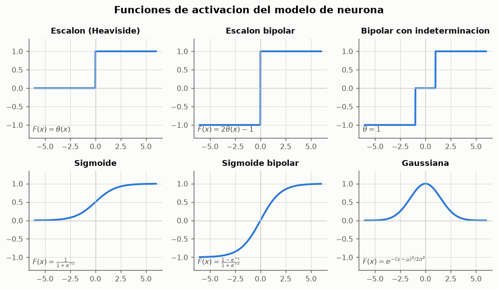

# 00 --- Fundamentos: el modelo de neurona y el vocabulario del curso

> Documento base. Fija la notacion que usan todos los modulos del paquete `ce_rna`
> y resume los conceptos de `clases/claseRN01.md` y `clases/claseRN02.md` sobre los
> que se apoyan los cuatro modelos implementados.

---

## 1. De la neurona biologica al elemento de proceso

El sistema nervioso central procesa informacion en el encefalo, formado por mas de
10^8 neuronas. La mayoria tiene tres estructuras diferenciadas:

| Estructura | Funcion | Contraparte en el modelo formal |
|---|---|---|
| **Dendritas** | vía de entrada de las señales | entradas `x_i` |
| **Sinapsis** | union entre neuronas; su eficacia cambia con el tiempo | pesos `w_ji` |
| **Cuerpo celular (soma)** | suma las señales recibidas | sumador `Σ` |
| **Axon** | transmite el impulso generado | salida `y_j` |

Dos hechos biologicos justifican la forma del modelo:

1. **Ley de todo o nada.** Una neurona en reposo tiene un potencial estable; cuando
   la suma de impulsos recibidos supera un umbral, dispara un potencial de accion.
   La respuesta no es graduada: se dispara o no se dispara. De ahi la funcion de
   activacion tipo **escalon**.
2. **Plasticidad.** La eficacia de una sinapsis se modifica con el uso. *"Es cuando
   decimos que el cerebro aprende."* De ahi que el aprendizaje en una red artificial
   consista, exclusivamente, en **modificar los pesos**.

La simplificacion teorica de una neurona se llama **elemento de proceso**; al
conjunto de elementos de proceso y sus conexiones, **red neuronal**.

> Una red neuronal es un procesador masivamente paralelo distribuido que es propenso
> por naturaleza a almacenar conocimiento experimental y hacerlo disponible para su
> uso. --- Simon Haykin

Desde el punto de vista ingenieril, una RNA es un **modelo matematico
multiparametrico no lineal** capaz de inducir una correspondencia entre conjuntos de
patrones (la relacion estimulo-respuesta).

---

## 2. El elemento de proceso

Una neurona `k` con `p` entradas se describe con tres ecuaciones:

$$\mu_k = \sum_{j=1}^{p} w_{kj}\,x_j \qquad \nu_k = \mu_k - \theta_k \qquad y_k = \varphi(\nu_k)$$

donde:

- `w_kj` es el **peso sinaptico** de la conexion desde la entrada `j` hacia la
  neurona `k`. Si `w_kj > 0` la conexion es **excitadora**; si `w_kj < 0`,
  **inhibidora**.
- `θ_k` es el **umbral** o polarizacion: controla el nivel a partir del cual la
  neurona produce salida.
- `φ` es la **funcion de activacion**, que limita la amplitud de la salida.

### 2.1 El truco de la neurona de inclinacion

Arrastrar `θ` como un parametro aparte es incomodo. En su lugar se anade una entrada
ficticia constante `x_0 = 1` --- la **neurona de inclinacion** (`bias`) --- cuyo peso
`w_0` juega el papel de `-θ`:

$$\nu = \sum_{j=1}^{p} w_j x_j - \theta = \sum_{j=0}^{p} w_j x_j \quad\text{con } x_0 = 1,\; w_0 = -\theta$$

Esta es la convencion que usan **todos** los modelos entrenables del paquete. Su
ventaja practica es decisiva: el umbral pasa a ser un peso mas y se aprende con la
misma regla que los demas, sin necesidad de ningun tratamiento especial.

En el codigo, la columna de unos se antepone en un unico punto:

```python
@staticmethod
def _con_inclinacion(X):
    X = np.atleast_2d(np.asarray(X, dtype=float))
    return np.hstack([np.ones((X.shape[0], 1)), X])
```

de modo que `W[j, 0]` es siempre el peso de inclinacion de la neurona `j`.

### 2.2 Notacion usada en todo el repositorio

| Simbolo | Significado | En el codigo |
|---|---|---|
| `m0` | numero de entradas (sin contar la inclinacion) | `n_entradas` |
| `m1` | numero de neuronas de salida | `n_salidas` |
| `N` | numero de pares de entrenamiento | `conjunto.n_patrones` |
| `x_i(n)` | componente `i` del patron `n` | `X[n, i]` |
| `d_j(n)` | salida deseada de la neurona `j` ante el patron `n` | `d[n, j]` |
| `y_j(n)` | salida producida | `modelo.predecir(X)` |
| `W` | matriz de sinapsis `m1 x (m0+1)` | `modelo.W` |
| `a`, `γ` | razon de aprendizaje | `razon_aprendizaje` |
| `θ` | umbral / punto de indeterminacion | `theta` |

---

## 3. Funciones de activacion

Implementadas en [`ce_rna/activaciones.py`](../ce_rna/activaciones.py).

| Nombre | Formula | Recorrido | Derivable | Uso en el curso |
|---|---|---|---|---|
| Escalon (Heaviside) | `θ(x)` | {0, 1} | no | McCulloch-Pitts |
| Escalon bipolar | `2θ(x) − 1` | {−1, +1} | no | Perceptron |
| Bipolar con zona neutra | `+1 / 0 / −1` | {−1, 0, +1} | no | Perceptron con punto de indeterminacion |
| Identidad | `x` | ℝ | si | Sensores, ADALINE |
| Sigmoide | `1/(1+e^-x)` | (0, 1) | si | Redes multicapa |
| Sigmoide bipolar | `(1−e^-x)/(1+e^-x)` | (−1, 1) | si | Redes multicapa |
| Gaussiana | `e^{-(x−μ)²/2σ²}` | (0, 1] | si | Redes de base radial |



> *"La eleccion de la funcion de activacion depende fuertemente del algoritmo de
> aprendizaje que se vaya a utilizar. Cuando la funcion de activacion es de tipo
> escalon el elemento de proceso recibe el nombre de perceptron."*

### 3.1 Por que la derivabilidad lo cambia todo

La derivada del escalon es cero en todo punto donde esta definida. Esto tiene una
consecuencia que atraviesa todo el repositorio: **no se puede aplicar descenso del
gradiente a una neurona con activacion escalon**, porque el gradiente del error
respecto a los pesos es identicamente nulo y no indica ninguna direccion de mejora.

De ahi las dos familias de reglas de aprendizaje que se implementan:

- **Reglas de correccion de error discretas** (perceptron, Hebb): no derivan de
  ningun gradiente; son procedimientos combinatorios con garantias propias.
- **Reglas de gradiente** (ADALINE, regla Delta): exigen una salida derivable, y por
  eso el ADALINE aprende sobre la salida **lineal**, aplicando el umbral solo despues,
  cuando ya no se esta aprendiendo.

### 3.2 El punto de indeterminacion

`ICE-claseRN03.md` introduce una variante del escalon bipolar con una banda neutra:

$$\varphi(v) = \begin{cases} +1 & v > \theta \\ 0 & |v| \leq \theta \\ -1 & v < -\theta \end{cases}$$

El valor 0 significa *"la neurona no sabe que responder"*. En el entrenamiento, una
salida 0 se cuenta como error (`0 ≠ ±1`), de modo que el algoritmo sigue corrigiendo
hasta que todos los patrones queden **fuera** de la banda. El efecto practico es que
θ actua como una exigencia de **margen**, verificada empiricamente en el
[experimento 02](../resultados/reportes/02_perceptron_and_or.md).

---

## 4. Arquitectura: capas

> *"Un rasgo que puede ayudar a definir una capa es el hecho de que todos los
> elementos de proceso que la forman usan la misma funcion de transferencia."*

- **Capa de entrada**: recibe los estimulos. No aprende; solo distribuye. Sus
  unidades son lineales (se dibujan como **cuadrados**).
- **Capas ocultas**: las que no son de entrada ni de salida. En una red multicapa
  **siempre son no lineales**; si fueran lineales, la red entera colapsaria a una
  red unicapa equivalente.
- **Capa de salida**: donde se forman las respuestas. Sus unidades pueden ser
  lineales (ADALINE) o no lineales (perceptron); se dibujan como **circulos** cuando
  son no lineales.

Por convencion **no se cuenta la capa de entrada**: la red con una capa de sinapsis
se llama *unicapa*. Todos los modelos de este repositorio son unicapa.

| Capas | Regiones de decision que puede formar |
|---|---|
| Unicapa | un semiplano (frontera lineal) |
| Dos capas | regiones convexas, abiertas o cerradas |
| Tres capas | regiones arbitrarias, tambien no convexas |

---

## 5. Paradigmas de aprendizaje

| Paradigma | Que recibe la red | Modelos de este repositorio |
|---|---|---|
| **Supervisado** | pares (entrada, salida deseada) | Perceptron, ADALINE, Hebb supervisado |
| **No supervisado** | solo entradas | --- (mapas de Kohonen, fuera de alcance) |
| **Por refuerzo** | solo si la respuesta es correcta o no | --- |
| **Hibrido** | combinacion de supervisado y no supervisado | --- |

En el aprendizaje supervisado, el proceso es *"completamente analogo a ensenarle
algo a un nino"*:

1. Se dispone de `N` pares de entrenamiento `(x_i(n), d_j(n))`.
2. Se presenta una entrada y se espera la respuesta de la red.
3. La red responde `O_j(n)`.
4. Se compara con la deseada y se forma la senal de error `e_j(n) = d_j(n) − O_j(n)`.
5. Con esa senal se corrigen las sinapsis.

Todas las reglas de aprendizaje comparten la misma forma general

$$w_{ji}(n+1) = w_{ji}(n) + \Delta w_{ji}(n)$$

y lo unico que las distingue es **como se calcula `Δw_ji(n)`**:

| Regla | `Δw_ji` | Necesita | Garantia |
|---|---|---|---|
| Hebb | `a · d_j · x_i` (siempre) | nada | ninguna |
| Perceptron | `a · d_j · x_i` (solo si `y_j ≠ d_j`) | comparar salida y objetivo | converge si es separable |
| Delta (ADALINE) | `γ · (d_j − y_j) · x_i` (siempre) | salida lineal | converge al minimo del ECM |

Las tres caben en una linea de codigo, y las diferencias entre ellas explican
practicamente todo el comportamiento observado en los siete experimentos.

---

## 6. Los tres aspectos de la teoria del aprendizaje

- **Capacidad**: cuantos patrones puede almacenar la red y que contornos de decision
  puede sintetizar. Para una red unicapa: solo fronteras lineales.
- **Complejidad de los ejemplos**: cuantos patrones hacen falta para garantizar un
  grado de generalizacion. En el [experimento 04](../resultados/reportes/04_perceptron_letras.md)
  se ve que dos prototipos bastan para clasificar bien retinas muy degradadas.
- **Complejidad computacional**: tiempo que necesita el algoritmo. Se mide en los
  experimentos como numero de epocas y de actualizaciones de pesos.

---

## 7. Propiedades de las redes neuronales que se verifican en este repositorio

| Propiedad enunciada en `claseRN01.md` | Donde se comprueba |
|---|---|
| "Las memorias se almacenan en el patron de pesos" | [Exp. 04](../resultados/reportes/04_perceptron_letras.md), mapas de pesos |
| "Las redes no se programan, se entrenan" | [Exp. 02](../resultados/reportes/02_perceptron_and_or.md) frente al [Exp. 01](../resultados/reportes/01_mcculloch_pitts.md) |
| "Actua como memoria asociativa" | [Exp. 07](../resultados/reportes/07_regla_hebb.md) |
| "Recupera informacion a partir de estimulos contaminados" | [Exp. 04](../resultados/reportes/04_perceptron_letras.md), curva de ruido |
| "Capacidad de generalizacion" | [Exp. 04](../resultados/reportes/04_perceptron_letras.md) |
| "Tolerancia a fallas de sus componentes" | [Exp. 04](../resultados/reportes/04_perceptron_letras.md), degradacion elegante |

---

## 8. Siguientes documentos

1. [01 --- McCulloch-Pitts y las compuertas logicas](01_mcculloch_pitts.md)
2. [02 --- El perceptron simple](02_perceptron_simple.md)
3. [03 --- ADALINE y la regla Delta](03_adaline.md)
4. [04 --- La regla de Hebb](04_regla_hebb.md)
5. [05 --- Guia de uso y referencia de la API](05_guia_de_uso.md)
