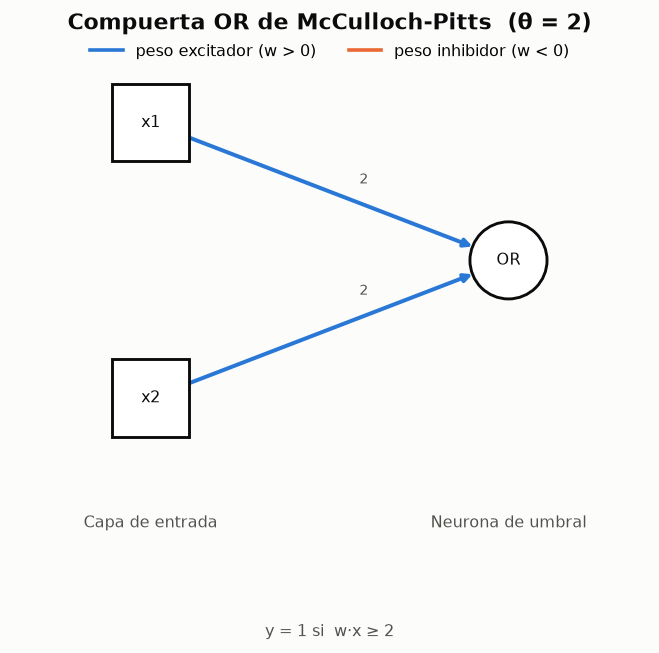

# 01 --- McCulloch-Pitts: la neurona de umbral y las compuertas logicas

> Modulo: [`ce_rna/mcculloch_pitts.py`](../ce_rna/mcculloch_pitts.py)
> Experimento: [`experimentos/exp01_mcculloch_pitts.py`](../experimentos/exp01_mcculloch_pitts.py)
> Informe generado: [`resultados/reportes/01_mcculloch_pitts.md`](../resultados/reportes/01_mcculloch_pitts.md)
> Fuente: `clases/claseRN02.md`

---

## 1. Contexto historico

En 1943 --- **antes de que se construyeran los primeros computadores** --- Warren
McCulloch, psiquiatra y neuroanatomista, y Walter Pitts, matematico, publicaron el
primer modelo formal de red neuronal. Su objetivo no era construir un sistema de
aprendizaje sino demostrar un resultado de **logica**: que una red de neuronas
idealizadas puede calcular cualquier funcion computable.

## 2. El modelo

Tres postulados definen el modelo:

1. Las neuronas son del tipo **binario**: su salida es 0 o 1.
2. Los umbrales y las sinapsis **se mantienen fijos**.
3. La funcion de activacion es del tipo **escalon**.

$$y^{(in)} = \sum_{i=1}^{n} w_i x_i \qquad
y = \varphi\!\left(y^{(in)}\right) = \begin{cases} 1 & y^{(in)} \geq \theta \\ 0 & y^{(in)} < \theta \end{cases}$$

El postulado 2 es el mas importante y el mas facil de pasar por alto: **este modelo
no aprende**. Los pesos son parte del diseno, igual que las resistencias de un
circuito. Todo lo que se implementa en este modulo es propagacion hacia adelante; el
aprendizaje aparece en los modulos siguientes.

### 2.1 Implementacion

```python
@dataclass
class NeuronaMCP:
    pesos: np.ndarray
    umbral: float
    nombre: str = "MCP"

    def potencial(self, X):
        return np.atleast_2d(X) @ self.pesos

    def activar(self, X):
        return self._phi(self.potencial(X))      # Escalon(umbral)
```

Toda la neurona cabe en dos operaciones: un producto matriz-vector y una comparacion.
El resto del modulo son constructores de compuertas y la maquinaria para componerlas.

---

## 3. Las compuertas AND y OR

### 3.1 AND

Pesos `(1, 1)`, umbral `θ = 2`.

| x1 | x2 | y_in | y |
|---|---|---|---|
| 0 | 0 | 0 | 0 |
| 0 | 1 | 1 | 0 |
| 1 | 0 | 1 | 0 |
| 1 | 1 | 2 | **1** |

La neurona solo dispara cuando **ambas** entradas valen 1, porque es el unico caso en
que la suma alcanza el umbral. El diseno generaliza a `n` entradas: pesos 1 y umbral
`n`.


### 3.2 OR

Pesos `(2, 2)`, umbral `θ = 2`.

| x1 | x2 | y_in | y |
|---|---|---|---|
| 0 | 0 | 0 | 0 |
| 0 | 1 | 2 | **1** |
| 1 | 0 | 2 | **1** |
| 1 | 1 | 4 | **1** |

Basta con que una entrada valga 1 para alcanzar el umbral. La parametrizacion `(2,2)`
con `θ=2` es la que aparece en la clase; la forma canonica equivalente seria pesos 1
con umbral 1. Ambas definen **la misma funcion** porque inducen la misma frontera:
multiplicar pesos y umbral por una constante positiva no cambia nada.



### 3.3 Interpretacion geometrica

La condicion de disparo `w1·x1 + w2·x2 ≥ θ` define un **semiplano**. La frontera es la
recta `w1·x1 + w2·x2 = θ`:

- AND: `x1 + x2 = 2`, que pasa justo por debajo de la esquina (1,1).
- OR: `2x1 + 2x2 = 2`, es decir `x1 + x2 = 1`, que deja fuera solo a (0,0).


Que ambas compuertas sean resolubles significa exactamente que sus tablas de verdad
son **linealmente separables**.

### 3.4 Compuertas con inhibicion

| Compuerta | Pesos | Umbral | Comentario |
|---|---|---|---|
| NOT | (−1) | 0 | una sola conexion inhibidora |
| NAND | (−1, −1) | −1 | dispara salvo cuando ambas valen 1 |
| NOR | (−1, −1) | 0 | solo dispara con ambas a 0 |

Las conexiones inhibidoras --- pesos negativos --- son lo que permite construir
negaciones, y con ellas cualquier funcion booleana.

---

## 4. El limite: el XOR

Una neurona MCP traza **una** frontera lineal. El XOR necesita dos. La demostracion
formal es inmediata: si existiera `(w0, w1, w2)` con

- `w0 + 0·w1 + 0·w2 < 0`  (patron (0,0) → 0)
- `w0 + w1 ≥ 0`           (patron (1,0) → 1)
- `w0 + w2 ≥ 0`           (patron (0,1) → 1)
- `w0 + w1 + w2 < 0`      (patron (1,1) → 0)

sumando las dos desigualdades centrales se obtiene

$$2w_0 + w_1 + w_2 \geq 0$$

Pero la primera dice que `w0 < 0` y la cuarta que `w0 + w1 + w2 < 0`, luego

$$2w_0 + w_1 + w_2 = w_0 + (w_0 + w_1 + w_2) < 0 + 0 = 0$$

Las dos conclusiones se contradicen, de modo que tal terna de pesos no existe.

El [experimento 01](../resultados/reportes/01_mcculloch_pitts.md) verifica esto
empiricamente recorriendo **343 neuronas** con pesos y umbral enteros en [−3, 3]: el
maximo son 3 aciertos de 4.


---

## 5. Universalidad: el XOR por composicion

Lo que una neurona no puede, tres si:

$$\text{XOR}(x_1,x_2) = \text{OR}(x_1,x_2) \;\wedge\; \neg\,\text{AND}(x_1,x_2)$$

| Neurona | Pesos | Umbral | Papel |
|---|---|---|---|
| `h_or` | (2, 2) | 2 | "al menos una entrada activa" |
| `h_and` | (1, 1) | 2 | "ambas entradas activas" |
| `y` | (+1, −2) | 1 | "h_or **y no** h_and" |

La neurona de salida usa una conexion inhibidora de peso −2, lo bastante fuerte como
para cancelar la excitacion de `h_or`.


| x1 | x2 | h_or | h_and | y |
|---|---|---|---|---|
| 0 | 0 | 0 | 0 | 0 |
| 0 | 1 | 1 | 0 | **1** |
| 1 | 0 | 1 | 0 | **1** |
| 1 | 1 | 1 | 1 | 0 |

La clave conceptual: en el espacio `(h_or, h_and)` los cuatro patrones **si** son
linealmente separables. La capa oculta no "resuelve" el XOR; lo **transforma** en un
problema que una frontera lineal ya puede resolver. Esa es la funcion de toda capa
oculta, y la razon por la que las redes multicapa superan la barrera de la
separabilidad lineal.

---

## 6. Omisiones del modelo

La propia clase enumera lo que el modelo deja fuera, y conviene tenerlo presente
antes de extrapolar conclusiones biologicas:

- Las neuronas reales **no son** unidades de umbral, sino de respuesta continua.
- La relacion entrada-salida es no lineal de una forma mas rica que un escalon.
- Hay **preprocesamiento dendritico**: el computo no es una simple suma ponderada.
- Responden con **secuencias de pulsos**, no con un unico nivel de salida.
- No todas tienen el mismo retardo, ni son sincronicas con un reloj central.
- La cantidad de neurotransmisor liberado varia de forma impredecible: un modelo fiel
  incluiria una componente **estocastica**.

---

## 7. API del modulo

| Elemento | Descripcion |
|---|---|
| `NeuronaMCP(pesos, umbral, nombre)` | unidad binaria de umbral |
| `.potencial(X)` / `.activar(X)` | suma ponderada / salida binaria |
| `.tabla_verdad()` | `DataFrame` con todas las entradas binarias |
| `.describir()` | regla de disparo en texto |
| `neurona_and(n)`, `neurona_or(n)`, `neurona_not()`, `neurona_nand(n)`, `neurona_nor(n)` | constructores |
| `RedMCP(entradas)` | grafo aciclico de neuronas |
| `.agregar(nombre, neurona, fuentes)` | anade un nodo (encadenable) |
| `.evaluar(X)` | activaciones de todos los nodos |
| `.salida(X)` | activacion del ultimo nodo |
| `.tabla_verdad()` | tabla con entradas, nodos internos y salida |
| `red_xor()` | la red de tres neuronas del apartado 5 |

### Ejemplo minimo

```python
from ce_rna.mcculloch_pitts import neurona_and, RedMCP, NeuronaMCP, neurona_or

and_ = neurona_and(2)
print(and_.tabla_verdad())

red = RedMCP(["x1", "x2"])
red.agregar("h_or", neurona_or(2), ["x1", "x2"])
red.agregar("h_and", neurona_and(2), ["x1", "x2"])
red.agregar("y", NeuronaMCP([1.0, -2.0], 1.0), ["h_or", "h_and"])
print(red.salida([[0, 1], [1, 1]]))     # -> [1. 0.]
```

---

## 8. Que falta y quien lo resuelve

| Carencia | Modelo que la corrige |
|---|---|
| Los pesos hay que calcularlos a mano | [Perceptron](02_perceptron_simple.md) |
| No hay medida de cuanto se equivoca | [ADALINE](03_adaline.md) |
| La salida solo puede ser binaria | [ADALINE](03_adaline.md) |
| Una sola capa no basta para el XOR | redes multicapa (fuera del alcance de este repositorio) |
