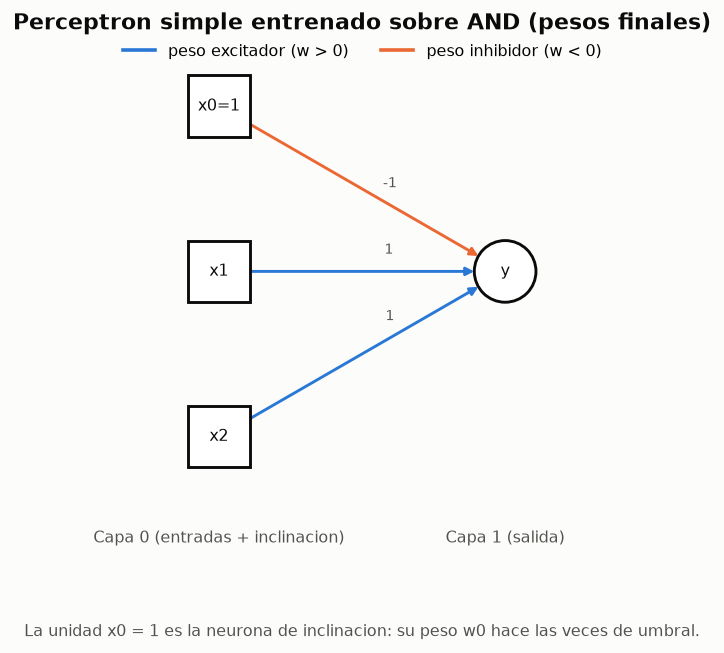
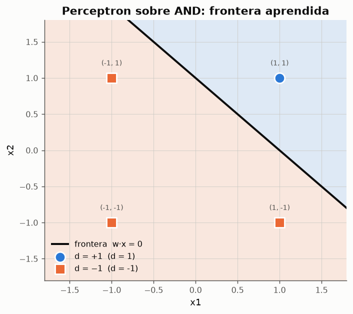

# 02 --- El perceptron simple: la primera red que aprende

> Modulo: [`ce_rna/perceptron.py`](../ce_rna/perceptron.py)
> Experimentos: [02 (AND/OR)](../experimentos/exp02_perceptron_and_or.py) ·
> [03 (XOR)](../experimentos/exp03_perceptron_xor.py) ·
> [04 (letras X/O)](../experimentos/exp04_perceptron_letras.py)
> Informes: [02](../resultados/reportes/02_perceptron_and_or.md) ·
> [03](../resultados/reportes/03_perceptron_xor.md) ·
> [04](../resultados/reportes/04_perceptron_letras.md)
> Fuentes: `clases/claseRN02.md`, `clases/ICE-claseRN03.md`

---

## 1. Que es

El perceptron simple (Rosenblatt, 1958) nacio *"como un primer intento de modelar la
retina"*. Es la red mas elemental que existe: **una sola capa** de neuronas de salida
no lineales, entrenada de forma **supervisada**.

La diferencia esencial con McCulloch-Pitts no esta en la arquitectura --- que es
practicamente la misma --- sino en que **los pesos ya no se disenan: se aprenden**.

> *"El dispositivo debe ser capaz de aprender la correlacion entrada/salida."*

---

## 2. Arquitectura

$$y_j^{(in)}(n) = \sum_{i=0}^{m_0} w_{ji}(n)\, x_i(n), \qquad y_j(n) = \varphi\!\left(y_j^{(in)}(n)\right)$$

- `m0` entradas mas la **neurona de inclinacion** `x0 = 1`.
- `m1` neuronas de salida, cada una representando una clase.
- Matriz de sinapsis `W` de dimension `m1 × (m0+1)`.
- Activacion: escalon bipolar, opcionalmente con punto de indeterminacion.



> *"Cada neurona de salida representa a una clase determinada: si una de ellas se
> activa con una entrada, significa que pertenece a esa clase; si esta desactivada,
> que no pertenece."*

Con `m1 > 1` esto es un esquema **uno contra el resto**: cada neurona es un
perceptron independiente que aprende su propia frontera. En el
[experimento 04](../resultados/reportes/04_perceptron_letras.md) hay dos neuronas
--- una por letra --- sobre una retina de 25 pixeles.

---

## 3. El algoritmo perceptronico

Transcripcion literal de `ICE-claseRN03.md`, con la correspondencia al codigo:

| Paso | Enunciado | Codigo |
|---|---|---|
| **0** | Inicializar las sinapsis (`w_ji = 0` o aleatorias). Elegir `0 < a < 1`. | `_inicializar_pesos()` |
| **1** | Mientras la condicion de parada del paso 5 sea falsa, repetir 2-5. | `for epoca in range(1, max_epocas+1)` |
| **2** | Para cada par de entrenamiento `(x_i(n), d_j(n))`, `n = 1..N`. | `for n in range(Xe.shape[0])` |
| **3** | Calcular `y_j^(in)(n)` y `y_j(n)` para `j = 1..m1`. | `y = self.phi(self.W @ x)` |
| **4** | Si `y_j ≠ d_j`: `w_ji(n+1) = w_ji(n) + a·d_j·x_i(n)`; si no, `w_ji(n+1) = w_ji(n)`. | `self.W[indices] += self.a * np.outer(objetivo[indices], x)` |
| **5** | Si los pesos no cambiaron en toda la epoca, parar. | `if n_actualizaciones == 0: break` |

```python
for n in range(Xe.shape[0]):
    x = Xe[n]
    potencial = self.W @ x            # paso 3
    y = self.phi(potencial)
    objetivo = d[n]
    fallan = y != objetivo
    if np.any(fallan):                # paso 4: correccion solo si hay error
        indices = np.flatnonzero(fallan)
        self.W[indices] += self.a * np.outer(objetivo[indices], x)
        n_actualizaciones += 1
```

### 3.1 Tres detalles que suelen pasarse por alto

**(a) La correccion usa `d`, no el error `d − y`.** Es la forma clasica de
Rosenblatt, y es la que aparece en la clase. En codificacion bipolar, cuando hay
error se cumple `y = −d`, luego `d − y = 2d`: ambas formulaciones difieren solo en un
factor 2 que absorbe la razon de aprendizaje. La unica situacion en que no coinciden
exactamente es cuando la salida cae en el punto de indeterminacion (`y = 0`), donde
`d − y = d` y ambas formulas son identicas.

**(b) La ambiguedad del paso 4 con varias salidas.** El texto dice *"si `y_j ≠ d_j`
para **algun** `j`... donde `j = 1,...,m1`"*, lo que leido al pie de la letra
significaria corregir **todas** las neuronas cuando falla una sola. La formulacion
habitual --- y la unica para la que vale el teorema de convergencia --- trata cada
neurona como un perceptron independiente. El codigo implementa la segunda por defecto
y ofrece la primera con `actualizar_todas_las_salidas=True`; el
[experimento 04](../resultados/reportes/04_perceptron_letras.md) compara ambas.

**(c) El criterio de parada es exacto.** No hay tolerancias ni umbrales arbitrarios:
la red se detiene cuando **ha dejado de equivocarse**. Esto es una virtud (no hay que
ajustar ningun parametro de parada) y un peligro (si el problema no es separable, no
para nunca, y hace falta una cota de epocas como salvaguarda).

---

## 4. Separabilidad lineal

La ecuacion `Σ w_ji x_i = 0` define un **hiperplano** en el espacio de entradas:

| Dimension de entrada | Frontera |
|---|---|
| 2 | una recta |
| 3 | un plano |
| n | un hiperplano |

Un problema es **linealmente separable** si existe un hiperplano que deja a un lado
todos los patrones de una clase y al otro los de la otra.



### 4.1 Teorema de convergencia del perceptron

> Si el conjunto de entrenamiento es linealmente separable, el algoritmo
> perceptronico converge en un **numero finito** de correcciones, cualesquiera que
> sean los pesos iniciales y la razon de aprendizaje.

*Idea de la demostracion* (Novikoff, 1962). Sea `w*` una solucion con margen
`γ = min_n d_n (w* · x_n) / ||w*|| > 0`, y sea `R = max_n ||x_n||`. Tras `k`
correcciones:

- El producto `w_k · w*` crece al menos `a·γ·||w*||` en cada correccion, luego
  `w_k · w* ≥ k·a·γ·||w*||`.
- La norma crece a lo sumo: `||w_k||² ≤ k·a²·R²`, porque una correccion solo ocurre
  cuando el patron estaba mal clasificado, lo que acota el termino cruzado.

Combinando con la desigualdad de Cauchy-Schwarz `w_k · w* ≤ ||w_k||·||w*||`:

$$k\,a\,\gamma\,\|w^*\| \leq \sqrt{k}\,a\,R\,\|w^*\| \;\Longrightarrow\; k \leq \frac{R^2}{\gamma^2}$$

El numero de correcciones esta acotado por `R²/γ²` --- **no depende de `a` ni de la
dimension**, solo de la geometria del problema. Lo que ocurre si el conjunto no es
separable es que no existe tal `w*` y la cota desaparece: es justo lo que se observa
en el [experimento 03](../resultados/reportes/03_perceptron_xor.md).

### 4.2 La solucion no es unica

> *"Es bastante evidente que si un problema es linealmente separable, existen
> infinitos pesos sinapticos que serviran... o no existe ninguna solucion, o existen
> infinitas."*

Dos motivos: (i) multiplicar `w` por cualquier constante positiva da el mismo
hiperplano; (ii) hay infinitos hiperplanos distintos que separan correctamente.


El perceptron se detiene en **el primero que encuentra**, que depende de la
inicializacion y del orden de presentacion. No busca el mejor, solo uno valido. Esta
es una limitacion real: en el [experimento 02](../resultados/reportes/02_perceptron_and_or.md)
sesenta inicializaciones producen sesenta fronteras distintas con margenes muy
dispares.

---

## 5. El punto de indeterminacion

$$\varphi(v) = \begin{cases} +1 & v > \theta \\ 0 & |v| \leq \theta \\ -1 & v < -\theta \end{cases}$$

Una salida 0 significa *"la neurona no sabe que responder"*. Como se cuenta como
error, el algoritmo sigue corrigiendo hasta sacar todos los patrones de la banda
neutra. Efecto medido en el experimento 02:

| θ | correcciones | `min |y_in|` |
|---|---|---|
| 0.0 | 1 | 1.0 |
| 0.5 | 1 | 1.0 |
| 1.0 | 4 | 2.0 |
| 2.0 | 7 | 3.0 |

Es decir: **θ compra margen a cambio de correcciones**. Tiene ademas un uso practico
en inferencia, que el [experimento 04](../resultados/reportes/04_perceptron_letras.md)
explota: permite que la red se **abstenga** ante entradas ambiguas en lugar de
arriesgar una clasificacion.

---

## 6. Resultados destacados de los experimentos

| Resultado | Donde |
|---|---|
| AND y OR aprendidos en 2 epocas desde pesos nulos | Exp. 02 |
| Con pesos iniciales nulos, `a` no altera la frontera (solo su escala) | Exp. 02 |
| La codificacion bipolar necesita menos correcciones que la binaria | Exp. 02 |
| El XOR no converge nunca; maximo teorico 75 % sobre 68 921 rectas | Exp. 03 |
| Los pesos aprendidos son plantillas visibles de 5x5 | Exp. 04 |
| Tolerancia al ruido hasta ~10 de 25 pixeles invertidos | Exp. 04 |
| Entrenar con ruido **empeora** el resultado frente al filtro adaptado | Exp. 04 |

---

## 7. API del modulo

```python
PerceptronSimple(
    n_entradas,                      # m0
    n_salidas=1,                     # m1
    razon_aprendizaje=1.0,           # a, 0 < a <= 1
    theta=0.0,                       # punto de indeterminacion
    inicializacion="ceros",          # "ceros" | "aleatoria"
    max_epocas=100,
    actualizar_todas_las_salidas=False,
    semilla=0,
)
```

| Metodo | Devuelve |
|---|---|
| `.entrenar(X, d, verbose=False, registrar_traza=False)` | el modelo (encadenable) |
| `.predecir(X)` | salidas bipolares |
| `.potencial(X)` | `y^(in)` sin umbralizar |
| `.clasificar(X)` | indice de la neurona con mayor potencial |
| `.exactitud(X, d)` | fraccion de patrones correctos |
| `.recta_frontera(j)` | `(w0, w1, w2)` de la neurona `j` |
| `.historial_df()` | epocas, correcciones, errores, exactitud |
| `.traza_df()` | una fila por presentacion de patron |
| `.resumen()` | estado y pesos en texto |

| Atributo | Contenido |
|---|---|
| `.W` | matriz de sinapsis `m1 × (m0+1)` |
| `.convergio` | si se cumplio el paso 5 |
| `.epocas_usadas` | epocas consumidas |
| `.trayectoria_pesos` | lista con `W` tras cada correccion |

### Ejemplo minimo

```python
from ce_rna.perceptron import PerceptronSimple
from ce_rna import datasets as ds

conjunto = ds.compuerta("AND", "bipolar")
modelo = PerceptronSimple(n_entradas=2, razon_aprendizaje=1.0).entrenar(conjunto.X, conjunto.d)

print(modelo.resumen())
print(modelo.predecir(conjunto.X))       # [-1. -1. -1.  1.]
print(modelo.recta_frontera())           # (-1.0, 1.0, 1.0)
```

---

## 8. Limitaciones

1. **Solo problemas linealmente separables.** Es una limitacion de la arquitectura,
   no del algoritmo: ninguna regla de aprendizaje puede hacer que una recta separe el
   XOR.
2. **No hay funcion objetivo.** El perceptron no minimiza nada; se detiene en
   cualquier solucion consistente. No hay forma de preguntarle "cuanto de bien lo
   estas haciendo" mas alla de contar errores.
3. **Salida binaria.** No puede aproximar funciones de salida real. Esta es la
   carencia que ataca el [ADALINE](03_adaline.md).
4. **Sin criterio de calidad, la solucion depende del azar** de la inicializacion y
   del orden de presentacion.
