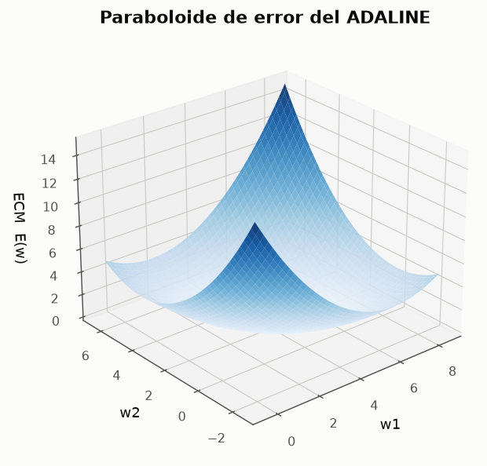
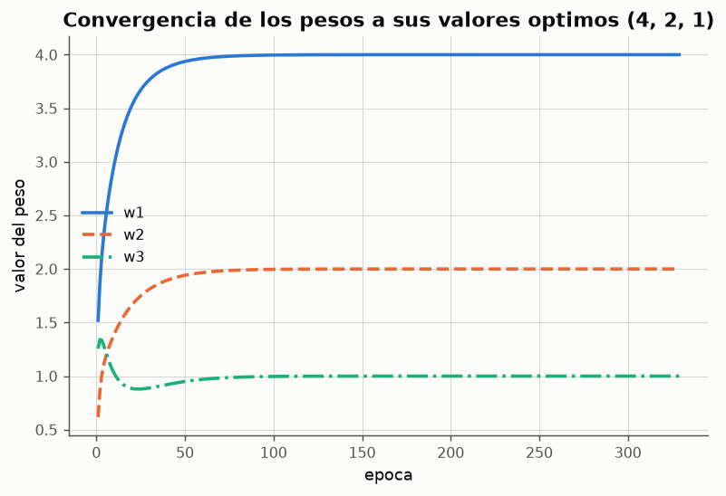

# 03 --- ADALINE y la regla Delta

> Modulo: [`ce_rna/adaline.py`](../ce_rna/adaline.py)
> Experimentos: [05 (descodificador)](../experimentos/exp05_adaline_decodificador.py) ·
> [06 (comparacion)](../experimentos/exp06_perceptron_vs_adaline.py)
> Informes: [05](../resultados/reportes/05_adaline_decodificador.md) ·
> [06](../resultados/reportes/06_perceptron_vs_adaline.md)
> Fuente: `clases/ICE-claseRN04.md`

---

## 1. El problema que resuelve

El perceptron es un **clasificador**, y lo es por una razon concreta: su salida pasa
por una funcion escalon, de modo que *"al ser binarias, solo pueden codificar un
conjunto discreto de estados"*.

> *"Si las salidas fueran numeros reales, podrian codificar cualquier tipo de salida
> y se convertirian en sistemas de resolucion de problemas generales (ej. aproximar
> una funcion cualquiera F(xi) = yi). Sin embargo, la naturaleza de la regla de
> aprendizaje del PERCEPTRON no permite producir salidas reales."*

Widrow y Hoff (1960) propusieron un sistema de aprendizaje **que si tiene en cuenta
el error producido**: la ADAptive LInear NEuron.

---

## 2. La idea central

La arquitectura es *"practicamente identica a la del perceptron"*. El cambio esta en
**que se usa para aprender**:

| | Perceptron | ADALINE |
|---|---|---|
| Salida usada en el aprendizaje | la **umbralizada** `φ(w·x)` | la **lineal** `w·x` |
| Senal de correccion | `d` (todo o nada) | `d − y` (error real) |
| Cuando corrige | solo si se equivoca | siempre |
| Que optimiza | nada explicito | el error cuadratico medio |

La consecuencia es profunda: al no haber escalon, la salida es **derivable respecto a
los pesos**, y el aprendizaje puede formularse como un **descenso del gradiente**
sobre una funcion de error bien definida.

---

## 3. Derivacion de la regla Delta

El error cuadratico sobre el patron `p` y el error global son

$$E^{p} = \tfrac{1}{2}\left(d^{p} - y^{p}\right)^{2}, \qquad E = \frac{1}{N}\sum_{p} E^{p}$$

Se busca modificar cada peso proporcionalmente a **menos** la derivada del error:

$$\Delta^{p} w_j = -\gamma\,\frac{\partial E^{p}}{\partial w_j}$$

Aplicando la regla de la cadena:

$$\frac{\partial E^{p}}{\partial w_j} = \frac{\partial E^{p}}{\partial y^{p}}\,\frac{\partial y^{p}}{\partial w_j}$$

Al ser una unidad lineal sin funcion de activacion en la salida:

$$\frac{\partial y^{p}}{\partial w_j} = x_j, \qquad \frac{\partial E^{p}}{\partial y^{p}} = -(d^{p} - y^{p})$$

y sustituyendo se obtiene la **regla Delta**:

$$\boxed{\;\Delta^{p} w_j = \gamma\,(d^{p} - y^{p})\,x_j\;}$$

> *"La regla Delta es una extension de la regla del PERCEPTRON a valores de salida
> reales."*

### 3.1 Nota sobre el signo en el enunciado de la clase

El procedimiento de la clase dice en su paso 5 *"modificar el peso **restando** del
valor antiguo la cantidad obtenida en 4"*. Eso es coherente solo si en el paso 4 se
calcula la cantidad **con el signo del gradiente**, es decir `−(d−y)x`. Escrito con el
incremento `Δw = +γ(d−y)x` --- que es la formula final de la propia clase --- el peso
se **suma**. Las dos redacciones describen el mismo descenso; el codigo implementa la
segunda:

```python
y = float(x @ self.w)                      # paso 3: salida LINEAL
error = d[n] - y                           # paso 3: diferencia (d - y)
self.w = self.w + self.gamma * error * x   # pasos 4 y 5
```

Esta comprobacion no es retorica: la prueba `probar_gradiente_coincide_con_derivada_numerica`
de [`pruebas/pruebas.py`](../pruebas/pruebas.py) verifica que el gradiente
implementado coincide con la derivada numerica de `E` con tolerancia `1e-6`.

---

## 4. La superficie de error

Para una unidad lineal, `E(w)` es una **forma cuadratica**:

$$E(w) = \frac{1}{2N}\,\|d - Xw\|^{2} = \frac{1}{2}\left(w^{T} R\, w - 2 p^{T} w + \overline{d^2}\right)$$

con `R = X^T X / N` (matriz de correlacion de las entradas) y `p = X^T d / N`.
Como `R` es semidefinida positiva, la superficie es un **paraboloide convexo**: tiene
un unico minimo global y **ningun minimo local** donde el gradiente pueda quedar
atrapado.




El minimo se obtiene anulando el gradiente, lo que da las **ecuaciones normales**:

$$R\,w^{*} = p \quad\Longleftrightarrow\quad X^{T}X\,w^{*} = X^{T}d$$

que el modulo resuelve en `solucion_minimos_cuadrados()` y usa como patron de oro
para medir cuanto le falta al descenso del gradiente.

### 4.1 Condicion de estabilidad de γ

En modo por lotes, la actualizacion es `w ← w − γ(Rw − p)`, luego el error respecto
al optimo evoluciona como

$$(w_{k+1} - w^{*}) = (I - \gamma R)\,(w_k - w^{*})$$

La iteracion converge si y solo si todos los autovalores de `I − γR` tienen modulo
menor que 1, es decir:

$$0 < \gamma < \frac{2}{\lambda_{max}}$$

donde `λ_max` es el mayor autovalor de `R`. El metodo `.cota_estabilidad(X)` la
calcula. Para el descodificador de 3 bits vale **1.0718**, y el
[experimento 05](../resultados/reportes/05_adaline_decodificador.md) confirma que con
`γ = 1.0` el aprendizaje ya diverge.

Esta es la diferencia practica mas incomoda frente al perceptron: **el ADALINE puede
diverger si γ es demasiado grande**, mientras que la convergencia del perceptron no
depende del valor de `a`.

---

## 5. Modo estocastico y modo por lotes

| | Estocastico (LMS) | Por lotes |
|---|---|---|
| Cuando actualiza | tras **cada** patron | tras recorrer todo el conjunto |
| Gradiente que usa | aproximacion ruidosa | gradiente exacto de `E` |
| Actualizaciones por epoca | `N` | 1 |
| Monotonia del error | no garantizada | garantizada bajo la cota |

El procedimiento descrito en la clase --- *"introducir un patron de entrada... si no
se ha cumplido el criterio de convergencia, regresar a 2"* --- es el **estocastico**,
que es el modo por omision del codigo. Medido en el experimento 05 sobre el
descodificador: 329 epocas en estocastico frente a 2418 en lotes para la misma
tolerancia.

---

## 6. El caso de estudio: descodificador de binario a decimal

El ejercicio propuesto en la clase. Entrada: 3 bits. Salida deseada: su valor decimal.

| b2 | b1 | b0 | d |
|---|---|---|---|
| 0 | 0 | 0 | 0 |
| 0 | 0 | 1 | 1 |
| 0 | 1 | 0 | 2 |
| ... | | | |
| 1 | 1 | 1 | 7 |

La solucion analitica es lineal, con pesos iguales al **valor posicional** de cada
bit: `w* = (0, 4, 2, 1)`. El ADALINE la recupera con error del orden de `1e-8`:

| peso | optimo | ADALINE |
|---|---|---|
| w0 (sesgo) | 0 | 1.6e−08 |
| w1 (bit 2) | 4 | 4.000000 |
| w2 (bit 1) | 2 | 2.000000 |
| w3 (bit 0) | 1 | 1.000000 |



Es un caso poco habitual en el que los pesos de una red neuronal tienen
**interpretacion semantica directa**: la red ha descubierto por si sola la notacion
posicional binaria. El resultado se mantiene con 4 y 5 bits.

---

## 7. Diferencias con el PERCEPTRON (las cuatro de la clase)

1. En el PERCEPTRON la salida es binaria; en el ADALINE es real.
2. En el PERCEPTRON la diferencia entre salida deseada y obtenida es 0 si ambas
   pertenecen a la misma categoria y ±1 si no; en el ADALINE se calcula la
   **diferencia real**.
3. En el ADALINE existe una medida de **cuanto** se ha equivocado la red; en el
   PERCEPTRON solo se determina **si** se ha equivocado.
4. En el ADALINE hay una razon de aprendizaje `γ ∈ (0,1)` que regula cuanto afecta
   cada equivocacion a la modificacion de los pesos.

### 7.1 Un matiz importante, medido en el experimento 06

Suele decirse que el ADALINE "coloca mejor la frontera". Los datos obligan a
matizarlo:

- Sobre **AND y OR** ambas reglas convergen a la **misma frontera**: la solucion de
  minimos cuadrados del AND bipolar es `(−0.5, 0.5, 0.5)`, exactamente proporcional a
  la `(−1, 1, 1)` del perceptron.
- Sobre **60 patrones dispersos**, la solucion exacta de minimos cuadrados clasifica
  mal un 1.7 % de los patrones y tiene **margen negativo**, mientras que el perceptron
  los separa todos.

El motivo es que **minimizar el error cuadratico no es lo mismo que separar clases**.
El ECM penaliza a los patrones muy alejados de la frontera aunque esten bien
clasificados, y puede inclinar la recta hasta cruzar a un patron correcto con tal de
reducir esa penalizacion. El ADALINE es la herramienta adecuada cuando la salida
deseada es una **magnitud real**; para clasificar, el ECM es un objetivo sustituto.

---

## 8. Limitaciones

> *"El problema de este tipo de modelos, y la razon por la que fueron descartados
> como solucion general de problemas, es que solo resuelven problemas en los que los
> ejemplos son linealmente separables en terminos de clasificacion, o en los que las
> salidas son funciones lineales de las entradas."*

Sobre el XOR, el ADALINE **si converge** --- pero converge a `w ≈ 0`, prediciendo 0
para los cuatro patrones, con un ECM de 0.5. Es el comportamiento de una regresion
lineal sobre datos sin componente lineal. Y aqui hay una diferencia de caracter
importante frente al perceptron: ante un problema imposible, el perceptron **oscila
indefinidamente** (sintoma visible) y el ADALINE **se detiene tranquilamente en la
mejor solucion mala** (sin avisar de nada). Con el ADALINE hay que mirar el error
residual para darse cuenta de que el problema no era soluble.

---

## 9. API del modulo

```python
Adaline(
    n_entradas,
    razon_aprendizaje=0.01,       # gamma
    modo="estocastico",           # "estocastico" | "lote"
    tolerancia=1e-6,              # criterio de parada sobre el cambio de pesos
    max_epocas=200,
    inicializacion="aleatoria",   # "aleatoria" (0..1) | "ceros" | vector
    barajar=False,
    semilla=0,
)
```

| Metodo | Devuelve |
|---|---|
| `.entrenar(X, d, verbose, registrar_pasos, registrar_traza)` | el modelo |
| `.predecir(X)` | salida **lineal** `w·x` |
| `.predecir_clase(X)` | salida umbralizada (solo para clasificar) |
| `.ecm(X, d)` | error cuadratico medio |
| `.cota_estabilidad(X)` | `2/λ_max` |
| `.historial_df()` / `.traza_df()` | evolucion por epoca / por patron |
| `.resumen()` | estado y pesos en texto |

| Funcion del modulo | Uso |
|---|---|
| `solucion_minimos_cuadrados(X, d)` | minimo global exacto |
| `ecm_de_pesos(w, X, d)` | `E(w)` para pesos arbitrarios |
| `superficie_error(X, d, indices, ...)` | malla `(W_i, W_j, E)` para graficar |

| Atributo | Contenido |
|---|---|
| `.w` | vector de pesos `(n+1,)`, con `w[0]` el sesgo |
| `.convergio` / `.diverged` | estado final |
| `.trayectoria_pesos` | trayectoria completa del aprendizaje |

### Ejemplo minimo

```python
from ce_rna.adaline import Adaline, solucion_minimos_cuadrados
from ce_rna import datasets as ds

conjunto = ds.decodificador_binario(3)
modelo = Adaline(3, razon_aprendizaje=0.05, max_epocas=1000, tolerancia=1e-9)
modelo.entrenar(conjunto.X, conjunto.d)

print(modelo.w)                                       # ~ [0. 4. 2. 1.]
print(modelo.ecm(conjunto.X, conjunto.d))             # ~ 3e-17
print(solucion_minimos_cuadrados(conjunto.X, conjunto.d))
```
