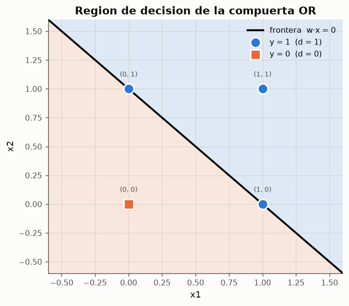

# Experimento 01 --- McCulloch-Pitts: compuertas logicas AND y OR

> Informe generado automaticamente por los scripts de `experimentos/` el 2026-09-14 22:46.
> No editar a mano: se regenera con `python experimentos/ejecutar_todo.py`.

Primer modelo formal de neurona (McCulloch y Pitts, 1943). Las neuronas son binarias, los umbrales y las sinapsis **se mantienen fijos** --- no hay aprendizaje --- y la funcion de activacion es un escalon. El experimento verifica las compuertas AND y OR tal como se presentan en `claseRN02.md`, dibuja sus regiones de decision y demuestra por busqueda exhaustiva que una sola neurona de umbral no puede calcular el XOR, para despues construirlo componiendo tres neuronas.

## 1. El modelo de neurona

El potencial de la neurona es la suma ponderada de sus entradas y la salida aplica la *ley de todo o nada* del impulso nervioso:

$$
y^{(in)} = \sum_{i=1}^{n} w_i x_i \qquad y = \varphi\left(y^{(in)}\right) = \begin{cases} 1 & \text{si } y^{(in)} \geq \theta \\ 0 & \text{si } y^{(in)} < \theta \end{cases}
$$

- Las neuronas son del tipo **binario**.
- Los umbrales y las sinapsis **se mantienen fijos**: los pesos se disenan, no se aprenden.
- La funcion de activacion es del tipo **escalon**.
- Pesos positivos = conexiones excitadoras; pesos negativos = conexiones inhibidoras.

## 2. Compuertas AND y OR

### 2.1 Compuerta AND

Pesos `w = [1. 1.]`, umbral `θ = 2`. Regla de disparo: `y = 1 si (1*x1 + 1*x2) >= 2, si no y = 0`.

**Tabla de verdad calculada por la neurona AND**

| x1 | x2 | y_in | y |
|---|---|---|---|
| 0 | 0 | 0 | 0 |
| 0 | 1 | 1 | 0 |
| 1 | 0 | 1 | 0 |
| 1 | 1 | 2 | 1 |

*Datos completos: [`01_tabla_and.csv`](../tablas/01_tabla_and.csv)*

Verificacion automatica frente a la tabla de verdad de referencia: **CORRECTA**.

*Figura: Arquitectura de la compuerta AND.*

*Figura: La recta 1·x1 + 1·x2 = 2 separa las entradas que producen 1 de las que producen 0.*

### 2.2 Compuerta OR

Pesos `w = [2. 2.]`, umbral `θ = 2`. Regla de disparo: `y = 1 si (2*x1 + 2*x2) >= 2, si no y = 0`.

**Tabla de verdad calculada por la neurona OR**

| x1 | x2 | y_in | y |
|---|---|---|---|
| 0 | 0 | 0 | 0 |
| 0 | 1 | 2 | 1 |
| 1 | 0 | 2 | 1 |
| 1 | 1 | 4 | 1 |

*Datos completos: [`01_tabla_or.csv`](../tablas/01_tabla_or.csv)*

Verificacion automatica frente a la tabla de verdad de referencia: **CORRECTA**.

*Figura: Arquitectura de la compuerta OR.*

*Figura: La recta 2·x1 + 2·x2 = 2 separa las entradas que producen 1 de las que producen 0.*

### 2.3 Otras compuertas elementales

**Compuertas NOT, NAND y NOR con neuronas MCP**

| compuerta | pesos | umbral | salidas |
|---|---|---|---|
| NOT | [-1.] | 0 | 10 |
| NAND | [-1. -1.] | -1 | 1110 |
| NOR | [-1. -1.] | 0 | 1000 |

*Datos completos: [`01_otras_compuertas.csv`](../tablas/01_otras_compuertas.csv)*

La columna `salidas` lista la respuesta de la neurona para las entradas en orden (0,0), (0,1), (1,0), (1,1) --- o (0), (1) en el caso del NOT. NAND y NOR se obtienen con **conexiones inhibidoras**: pesos negativos.

## 3. Limite del modelo: el XOR

Se recorrieron **343 neuronas** distintas (todas las combinaciones de pesos enteros w1, w2 y umbral θ en el rango [-3, 3]) evaluando los cuatro patrones del XOR. El maximo numero de aciertos alcanzado es **3 de 4**, logrado por 52 configuraciones: ninguna neurona de umbral resuelve el XOR.

La razon es geometrica y no depende de la rejilla explorada: una neurona de umbral traza una **unica frontera lineal**, y el XOR no es linealmente separable (`ICE-claseRN03.md`: *"es imposible encontrar una linea recta que deje a un lado las entradas que deben producir 0, y al otro, las que deben producir 1"*).

**Distribucion de aciertos en la busqueda exhaustiva**

| aciertos | n_configuraciones |
|---|---|
| 1 | 46 |
| 2 | 245 |
| 3 | 52 |

*Datos completos: [`01_busqueda_xor.csv`](../tablas/01_busqueda_xor.csv)*

*Figura: Los patrones del XOR alternan en diagonal: no hay recta que los separe.*

## 4. XOR por composicion de neuronas

McCulloch y Pitts demostraron que *"todas las funciones logicas se pueden describir mediante combinaciones apropiadas de neuronas de este tipo"*. El XOR se obtiene como

$$
\text{XOR}(x_1,x_2) = \text{OR}(x_1,x_2) \;\wedge\; \neg\,\text{AND}(x_1,x_2)
$$

La neurona de salida implementa ese *AND con una entrada inhibidora* con pesos (+1, −2) y umbral 1: la conexion inhibidora procedente de `h_and` cancela la excitacion de `h_or` cuando ambas entradas valen 1.

**Activaciones internas y salida de la red XOR**

| x1 | x2 | h_or | h_and | y |
|---|---|---|---|---|
| 0 | 0 | 0 | 0 | 0 |
| 0 | 1 | 1 | 0 | 1 |
| 1 | 0 | 1 | 0 | 1 |
| 1 | 1 | 1 | 1 | 0 |

*Datos completos: [`01_tabla_xor_red.csv`](../tablas/01_tabla_xor_red.csv)*

Verificacion frente a la tabla de verdad del XOR: **CORRECTA**.

*Figura: Composicion OR / AND / AND-inhibido. Se indica el umbral θ bajo cada neurona.*

## 5. Conclusiones

- Las compuertas AND (pesos 1,1; θ=2) y OR (pesos 2,2; θ=2) de `claseRN02.md` reproducen **exactamente** sus tablas de verdad.
- Ambas son linealmente separables: una sola recta basta para dividir el plano.
- Ninguna de las 343 neuronas MCP exploradas resuelve el XOR (maximo 3/4 aciertos): el modelo de una unidad esta limitado a problemas linealmente separables.
- Componiendo tres neuronas si se obtiene el XOR, lo que ilustra el resultado de universalidad del articulo de 1943.
- El modelo carece por completo de aprendizaje: los pesos se calculan a mano. Ese es exactamente el vacio que llenan el perceptron (experimento 02) y el ADALINE (experimento 05).
