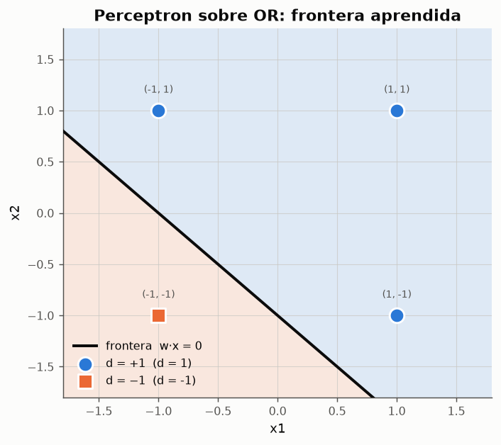
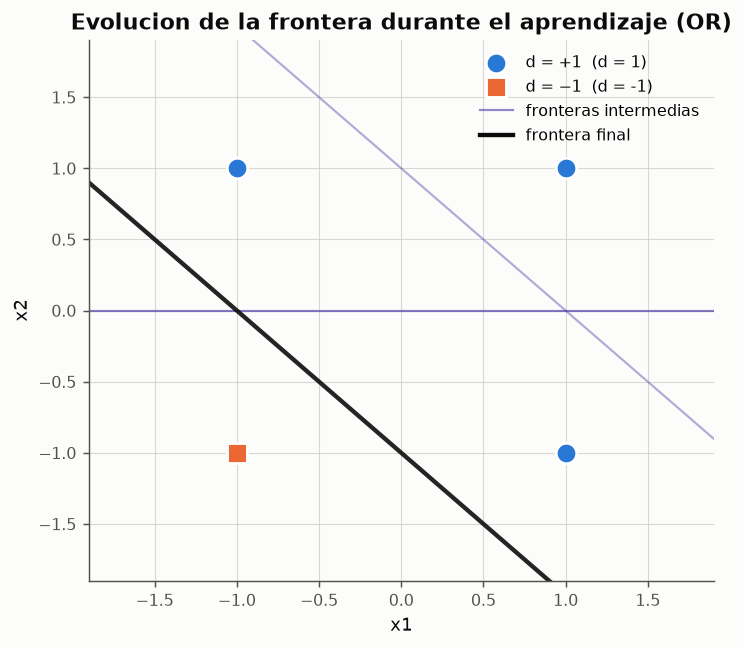

# Experimento 02 --- Perceptron simple: aprendizaje de AND y OR

> Informe generado automaticamente por los scripts de `experimentos/` el 2026-09-14 22:46.
> No editar a mano: se regenera con `python experimentos/ejecutar_todo.py`.

El perceptron de Rosenblatt (1958) es la primera red **que aprende**: en lugar de fijar los pesos a mano como en McCulloch-Pitts, los ajusta a partir de ejemplos mediante la regla perceptronica. Este experimento entrena una red unicapa de una sola neurona de salida sobre las compuertas AND y OR, audita el algoritmo paso a paso y estudia como afectan la razon de aprendizaje, el punto de indeterminacion, la inicializacion y la codificacion de los datos.

## 1. Arquitectura y regla de aprendizaje

La red es **unicapa**: m0 = 2 entradas mas la *neurona de inclinacion* x0 = 1 (que sustituye al umbral) y m1 = 1 neurona de salida no lineal con activacion escalon bipolar.

$$
y^{(in)}(n) = \sum_{i=0}^{m_0} w_i(n)\,x_i(n), \qquad y(n) = \varphi\left(y^{(in)}(n)\right) = \begin{cases} +1 & y^{(in)} > \theta \\ 0 & |y^{(in)}| \leq \theta \\ -1 & y^{(in)} < -\theta \end{cases}
$$

**Algoritmo perceptronico** (pasos 0 a 5 de `ICE-claseRN03.md`):

- **Paso 0**: inicializar las sinapsis (w = 0 o aleatorias) y elegir 0 < a < 1.
- **Paso 1**: repetir mientras la condicion de parada del paso 5 sea falsa.
- **Paso 2**: para cada par de entrenamiento (x_i(n), d(n)).
- **Paso 3**: calcular el potencial y la salida.
- **Paso 4**: si y ≠ d, corregir `w_i(n+1) = w_i(n) + a·d·x_i(n)`; si no, no tocar nada.
- **Paso 5**: si los pesos no cambiaron en toda una epoca, parar.

Notese que la correccion usa la **salida deseada d**, no el error d − y: es la forma clasica de Rosenblatt que emplea la clase. Como la correccion solo se aplica cuando hay error, y en codificacion bipolar el error vale d − y = 2d cuando y = −d, ambas formulaciones difieren unicamente en un factor constante que absorbe la razon de aprendizaje.

*Figura: Red unicapa con neurona de inclinacion y los pesos aprendidos para el AND.*

## 2. Traza paso a paso sobre el AND

Pesos iniciales nulos, a = 1, codificacion bipolar. Cada fila es una presentacion de patron: se muestran el potencial `y_in`, la respuesta `y`, la deseada `d`, si hubo correccion y los pesos **despues** de aplicarla.

**Traza del entrenamiento del AND**

| epoca | patron | x1 | x2 | y_in | y | d | corrige | w0 | w1 | w2 |
|---|---|---|---|---|---|---|---|---|---|---|
| 1 | 1 | -1 | -1 | 0 | 1 | -1 | si | -1 | 1 | 1 |
| 1 | 2 | -1 | 1 | -1 | -1 | -1 | no | -1 | 1 | 1 |
| 1 | 3 | 1 | -1 | -1 | -1 | -1 | no | -1 | 1 | 1 |
| 1 | 4 | 1 | 1 | 1 | 1 | 1 | no | -1 | 1 | 1 |
| 2 | 1 | -1 | -1 | -3 | -1 | -1 | no | -1 | 1 | 1 |
| 2 | 2 | -1 | 1 | -1 | -1 | -1 | no | -1 | 1 | 1 |
| 2 | 3 | 1 | -1 | -1 | -1 | -1 | no | -1 | 1 | 1 |
| 2 | 4 | 1 | 1 | 1 | 1 | 1 | no | -1 | 1 | 1 |

*Datos completos: [`02_traza_and.csv`](../tablas/02_traza_and.csv)*

El primer patron (−1,−1) produce y_in = 0 y, por el criterio y_in ≥ 0 → +1, la red responde +1 cuando deberia responder −1. La correccion w ← w + a·d·x con d = −1 deja `w = [-1.  1.  1.]`, que ya resuelve los cuatro patrones; la segunda epoca transcurre sin cambios y el paso 5 detiene el algoritmo.

Con inicializacion aleatoria y a = 0.4 el recorrido es mas largo (2 epocas, 3 correcciones) y termina en pesos distintos, `w = [-0.275  0.797  0.676]`, que sin embargo clasifican igual de bien: la solucion no es unica.

**Primeras 12 presentaciones con inicializacion aleatoria (a = 0.4)**

| epoca | patron | x1 | x2 | y_in | y | d | corrige | w0 | w1 | w2 |
|---|---|---|---|---|---|---|---|---|---|---|
| 1 | 1 | -1 | -1 | -0.547804 | -1 | -1 | no | 0.125095 | 0.397214 | 0.275686 |
| 1 | 2 | -1 | 1 | 0.00356736 | 1 | -1 | si | -0.274905 | 0.797214 | -0.124314 |
| 1 | 3 | 1 | -1 | 0.646624 | 1 | -1 | si | -0.674905 | 0.397214 | 0.275686 |
| 1 | 4 | 1 | 1 | -0.00200504 | -1 | 1 | si | -0.274905 | 0.797214 | 0.675686 |
| 2 | 1 | -1 | -1 | -1.7478 | -1 | -1 | no | -0.274905 | 0.797214 | 0.675686 |
| 2 | 2 | -1 | 1 | -0.396433 | -1 | -1 | no | -0.274905 | 0.797214 | 0.675686 |
| 2 | 3 | 1 | -1 | -0.153376 | -1 | -1 | no | -0.274905 | 0.797214 | 0.675686 |
| 2 | 4 | 1 | 1 | 1.19799 | 1 | 1 | no | -0.274905 | 0.797214 | 0.675686 |

*Datos completos: [`02_traza_and_aleatoria.csv`](../tablas/02_traza_and_aleatoria.csv)*

## 3. Convergencia sobre AND y OR

*Figura: Region de decision aprendida para AND. Recta: -1 + 1·x1 + 1·x2 = 0.*

*Figura: Cada correccion rota y desplaza el hiperplano (corrida con inicializacion aleatoria y a = 0.4, que hace mas correcciones y deja ver el recorrido); la recta solida es la frontera final.*

*Figura: Region de decision aprendida para OR. Recta: 1 + 1·x1 + 1·x2 = 0.*

*Figura: Cada correccion rota y desplaza el hiperplano (corrida desde pesos nulos con a = 1); la recta solida es la frontera final.*

**Convergencia con pesos iniciales nulos y a = 1**

| compuerta | epocas | correcciones | convergio | w0 | w1 | w2 | exactitud | margen |
|---|---|---|---|---|---|---|---|---|
| AND | 2 | 1 | si | -1 | 1 | 1 | 1 | 0.707107 |
| OR | 2 | 3 | si | 1 | 1 | 1 | 1 | 0.707107 |

*Datos completos: [`02_convergencia_and_or.csv`](../tablas/02_convergencia_and_or.csv)*

El **margen geometrico** es la distancia minima de un patron a la frontera. Un margen positivo certifica que la separacion es correcta; su magnitud indica cuanta holgura tiene la solucion frente al ruido.

## 4. Efecto de la razon de aprendizaje

**Razon de aprendizaje frente a coste de convergencia (compuerta AND)**

| a | inicializacion | epocas | correcciones | w0 | w1 | w2 | margen |
|---|---|---|---|---|---|---|---|
| 0.1 | ceros | 2 | 1 | -0.1 | 0.1 | 0.1 | 0.7071 |
| 0.1 | aleatoria | 4 | 4 | -0.4144 | 0.1368 | 0.3013 | 0.0717 |
| 0.25 | ceros | 2 | 1 | -0.25 | 0.25 | 0.25 | 0.7071 |
| 0.25 | aleatoria | 2 | 2 | -0.4144 | 0.2368 | 0.3013 | 0.3229 |
| 0.5 | ceros | 2 | 1 | -0.5 | 0.5 | 0.5 | 0.7071 |
| 0.5 | aleatoria | 3 | 3 | -0.9144 | 0.2368 | 0.8013 | 0.1481 |
| 0.75 | ceros | 2 | 1 | -0.75 | 0.75 | 0.75 | 0.7071 |
| 0.75 | aleatoria | 3 | 3 | -1.1644 | 0.4868 | 1.0513 | 0.3226 |
| 1 | ceros | 2 | 1 | -1 | 1 | 1 | 0.7071 |
| 1 | aleatoria | 2 | 3 | -1.4144 | 0.7368 | 1.3013 | 0.4171 |

*Datos completos: [`02_razon_aprendizaje.csv`](../tablas/02_razon_aprendizaje.csv)*

Con **pesos iniciales nulos la razon de aprendizaje es irrelevante**: todos los pesos son multiplos de a, de modo que la frontera w·x = 0 --- y por tanto la sucesion de decisiones --- es identica para cualquier a. El numero de epocas solo cambia cuando los pesos iniciales no son nulos, porque entonces a controla el peso relativo de cada correccion frente al estado de partida.

## 5. Efecto del punto de indeterminacion θ

**El punto neutro obliga a separar con margen (compuerta AND)**

| theta | epocas | correcciones | convergio | w0 | w1 | w2 | margen | |w_in| minimo |
|---|---|---|---|---|---|---|---|---|
| 0 | 2 | 1 | si | -1 | 1 | 1 | 0.7071 | 1 |
| 0.5 | 2 | 1 | si | -1 | 1 | 1 | 0.7071 | 1 |
| 1 | 2 | 4 | si | -2 | 2 | 2 | 0.7071 | 2 |
| 2 | 3 | 7 | si | -3 | 3 | 3 | 0.7071 | 3 |

*Datos completos: [`02_theta.csv`](../tablas/02_theta.csv)*

Una salida dentro de la banda |y_in| ≤ θ significa *"la neurona no sabe que responder"* y se cuenta como error, de modo que el algoritmo sigue corrigiendo hasta que **todos** los patrones queden fuera de la banda. El resultado es una frontera con mas holgura: la columna `|w_in| minimo` crece con θ. Es el mismo principio que, llevado al limite, da lugar a los clasificadores de margen maximo.

## 6. Codificacion binaria frente a bipolar

**Ambas codificaciones convergen, pero no al mismo coste**

| codificacion | compuerta | epocas | correcciones | exactitud |
|---|---|---|---|---|
| binaria | AND | 6 | 11 | 1 |
| binaria | OR | 4 | 5 | 1 |
| bipolar | AND | 2 | 1 | 1 |
| bipolar | OR | 2 | 3 | 1 |

*Datos completos: [`02_codificacion.csv`](../tablas/02_codificacion.csv)*

Con entradas binarias, un patron con x_i = 0 **no puede modificar** el peso w_i, porque la correccion es proporcional a la entrada: los patrones apagados solo ajustan el sesgo. Con codificacion bipolar cada presentacion informa a todos los pesos. El perceptron converge igualmente en ambos casos --- su teorema de convergencia no depende de la codificacion --- pero la bipolar suele necesitar menos correcciones, y para la regla de Hebb (experimento 07) la diferencia es entre funcionar y no funcionar.

## 7. La solucion no es unica: infinitas fronteras validas

*Figura: 60 fronteras obtenidas con 60 inicializaciones aleatorias distintas. Todas clasifican el 100% de los patrones.*

*"Es bastante evidente que si un problema es linealmente separable, existen infinitos pesos sinapticos que serviran para solucionar el problema... o no existe ninguna solucion, o existen infinitas"* (`ICE-claseRN03.md`). Basta multiplicar w por una constante positiva para obtener el mismo hiperplano con pesos distintos; y ademas hay infinitos hiperplanos que separan correctamente. El perceptron se detiene en **el primero** que encuentra, que depende de la inicializacion y del orden de presentacion: no busca el mejor, solo uno valido. Esa es una limitacion real frente al ADALINE, que si tiene un criterio de optimalidad (el error cuadratico medio).

**Dispersion del margen entre las soluciones halladas**

| estadistico | margen_geometrico |
|---|---|
| minimo | 0.000525699 |
| mediana | 0.241269 |
| maximo | 0.496509 |

*Datos completos: [`02_margenes_soluciones.csv`](../tablas/02_margenes_soluciones.csv)*

## 8. Conclusiones

- El perceptron aprende AND y OR **desde pesos nulos en 2 epocas** y una sola correccion por compuerta: ambos problemas son linealmente separables y el teorema de convergencia garantiza un numero finito de pasos.
- La traza confirma que el algoritmo solo toca los pesos cuando se equivoca; cuando acierta, w(n+1) = w(n).
- Con pesos iniciales nulos la razon de aprendizaje **no altera la frontera**, solo la escala de los pesos. Con pesos aleatorios si influye en cuantas correcciones hacen falta.
- El punto de indeterminacion θ actua como exigencia de margen: fuerza soluciones mas holgadas a cambio de mas correcciones.
- La solucion hallada no es unica ni optima: con 60 inicializaciones se obtienen 60 fronteras validas distintas, con margenes que van de 0.00 a 0.50.
