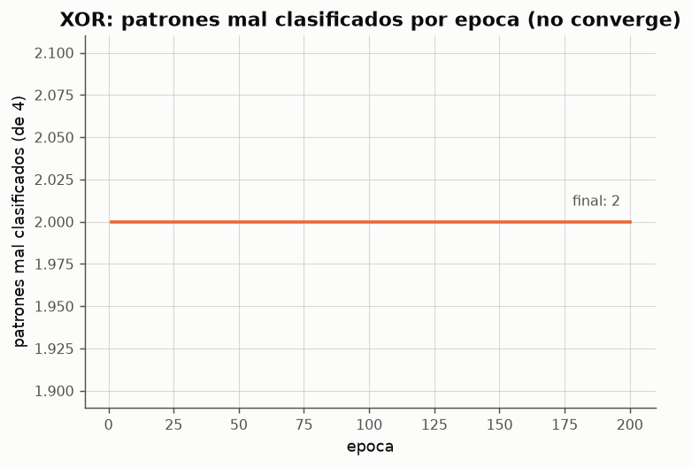
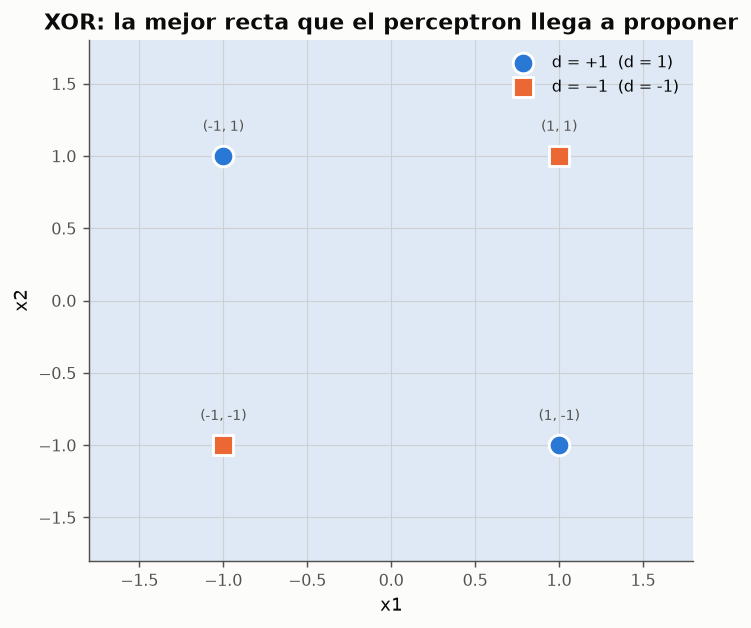
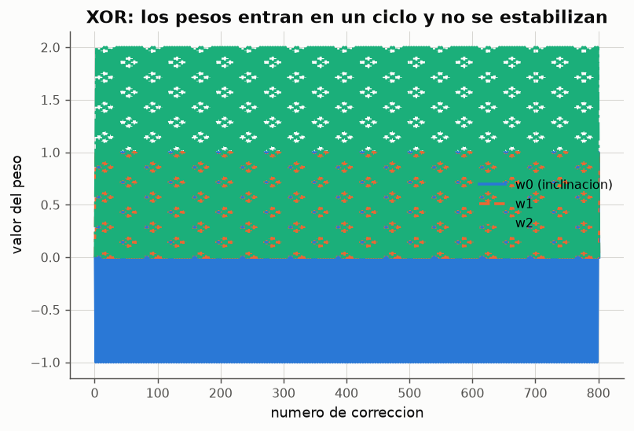
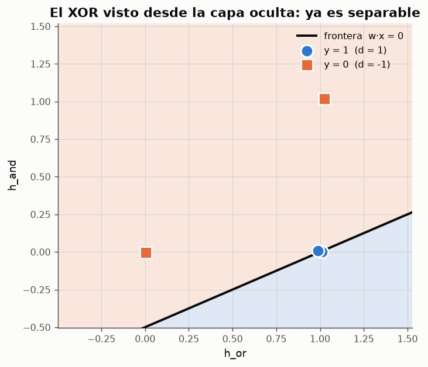

# Experimento 03 --- El limite del perceptron simple: el problema XOR

> Informe generado automaticamente por los scripts de `experimentos/` el 2026-09-14 22:46.
> No editar a mano: se regenera con `python experimentos/ejecutar_todo.py`.

Un perceptron de una capa solo puede trazar un hiperplano, de modo que solo resuelve problemas **linealmente separables**. El XOR no lo es. Este experimento documenta que el algoritmo perceptronico no converge sobre el XOR, mide hasta donde llega, y demuestra por busqueda exhaustiva sobre el espacio de pesos que el fallo no es del algoritmo sino de la arquitectura.

## 1. El XOR sobre el plano

**Tabla de verdad del XOR en codificacion bipolar**

| x1 | x2 | y |
|---|---|---|
| -1 | -1 | -1 |
| -1 | 1 | 1 |
| 1 | -1 | 1 |
| 1 | 1 | -1 |

*Datos completos: [`03_tabla_xor.csv`](../tablas/03_tabla_xor.csv)*

Los patrones de la clase +1 --- (−1,+1) y (+1,−1) --- ocupan una diagonal del cuadrado, y los de la clase −1 la otra. Cualquier recta que deje las dos esquinas de una diagonal a un lado deja tambien, necesariamente, al menos una de la otra diagonal.

## 2. El algoritmo perceptronico no se detiene

Con pesos iniciales nulos y a = 1 el algoritmo realiza **800 correcciones en 200 epocas** y **nunca** satisface el paso 5 (`convergio = False`). La ejecucion termina unicamente porque se alcanza el limite de epocas, que es una salvaguarda del programa, no un criterio del algoritmo.

**Primeras 12 epocas: la exactitud oscila y no mejora**

| epoca | actualizaciones | patrones_mal | exactitud |
|---|---|---|---|
| 1 | 4 | 2 | 0.5 |
| 2 | 4 | 2 | 0.5 |
| 3 | 4 | 2 | 0.5 |
| 4 | 4 | 2 | 0.5 |
| 5 | 4 | 2 | 0.5 |
| 6 | 4 | 2 | 0.5 |
| 7 | 4 | 2 | 0.5 |
| 8 | 4 | 2 | 0.5 |
| 9 | 4 | 2 | 0.5 |
| 10 | 4 | 2 | 0.5 |
| 11 | 4 | 2 | 0.5 |
| 12 | 4 | 2 | 0.5 |

*Datos completos: [`03_historial_xor.csv`](../tablas/03_historial_xor.csv)*

**Ninguna combinacion de parametros converge**

| a | inicializacion | convergio | epocas | correcciones | exactitud_final | exactitud_maxima |
|---|---|---|---|---|---|---|
| 0.2 | ceros | no | 200 | 800 | 0.5 | 0.5 |
| 0.2 | aleatoria (semilla 1) | no | 200 | 797 | 0.25 | 0.5 |
| 0.2 | aleatoria (semilla 2) | no | 200 | 798 | 0.25 | 0.25 |
| 0.5 | ceros | no | 200 | 800 | 0.5 | 0.5 |
| 0.5 | aleatoria (semilla 1) | no | 200 | 798 | 0.5 | 0.5 |
| 0.5 | aleatoria (semilla 2) | no | 200 | 798 | 0.5 | 0.5 |
| 1 | ceros | no | 200 | 800 | 0.5 | 0.5 |
| 1 | aleatoria (semilla 1) | no | 200 | 799 | 0.75 | 0.75 |
| 1 | aleatoria (semilla 2) | no | 200 | 798 | 0.5 | 0.5 |

*Datos completos: [`03_corridas_xor.csv`](../tablas/03_corridas_xor.csv)*

Nueve corridas con tres razones de aprendizaje y tres inicializaciones distintas: **ninguna converge**. La exactitud maxima observada en alguna epoca es 75% y la final oscila entre 25% y 75%. El resultado no depende de como se ajuste el algoritmo.

*Figura: El error nunca llega a cero: el ciclo de correcciones se repite indefinidamente.*

*Figura: Sea cual sea la recta, siempre queda al menos un patron del lado equivocado.*

*Figura: Trayectoria de los tres pesos. El patron se repite ciclicamente: el algoritmo deshace lo que acaba de aprender.*

**Primeras correcciones: el vector de pesos regresa a estados ya visitados**

| correccion | w0 | w1 | w2 |
|---|---|---|---|
| 0 | 0 | 0 | 0 |
| 1 | -1 | 1 | 1 |
| 2 | 0 | 0 | 2 |
| 3 | 1 | 1 | 1 |
| 4 | 0 | 0 | 0 |
| 5 | -1 | 1 | 1 |
| 6 | 0 | 0 | 2 |
| 7 | 1 | 1 | 1 |
| 8 | 0 | 0 | 0 |
| 9 | -1 | 1 | 1 |
| 10 | 0 | 0 | 2 |
| 11 | 1 | 1 | 1 |

*Datos completos: [`03_ciclo_pesos.csv`](../tablas/03_ciclo_pesos.csv)*

## 3. Busqueda exhaustiva: no es culpa del algoritmo

Se evaluaron **68 921 rectas** (rejilla de 41 valores por peso en [−3, 3]) sobre cada compuerta, midiendo cuantos de los cuatro patrones clasifica bien cada una. Si ninguna recta del espacio de pesos resuelve el XOR, el problema no esta en la regla de aprendizaje: esta en que la arquitectura solo sabe trazar rectas.

**Mejor recta posible para cada compuerta**

| compuerta | mejor_exactitud | patrones_resueltos | w0 | w1 | w2 |
|---|---|---|---|---|---|
| AND | 1 | 4 de 4 | -3 | 0.15 | 3 |
| OR | 1 | 4 de 4 | 0 | 0.15 | 0.15 |
| XOR | 0.75 | 3 de 4 | -3 | -3 | 0.15 |

*Datos completos: [`03_busqueda_rectas.csv`](../tablas/03_busqueda_rectas.csv)*

AND y OR alcanzan el 100 %; el XOR se queda en el **75 %** --- tres patrones de cuatro. Ese 75 % es la cota superior absoluta de cualquier red unicapa sobre el XOR. Conviene senalar que el algoritmo perceptronico ni siquiera se estabiliza en esa cota: como sigue corrigiendo eternamente, la recta que tiene en un instante dado puede ser peor que la mejor posible (en las corridas de la seccion 2 oscila alrededor del 50 %). El algoritmo no esta minimizando ningun error --- solo reacciona al ultimo patron mal clasificado --- y esa es justamente la carencia que el ADALINE corrige con la regla Delta (experimento 05).

## 4. Como se resuelve entonces el XOR

Hay dos caminos, y ambos consisten en **anadir una capa**, no en cambiar la regla de aprendizaje:

- **Componer neuronas a mano** (experimento 01): XOR = OR ∧ ¬AND, con tres neuronas de McCulloch-Pitts. Funciona, pero los pesos se disenan, no se aprenden.
- **Red multicapa** (`ICE-claseRN03.md`, seccion *Red Multicapa*): una capa oculta no lineal genera regiones convexas, y con tres capas se obtienen regiones arbitrarias. El precio es que la regla perceptronica ya no sirve --- no hay salida deseada para las neuronas ocultas --- y hace falta retropropagacion, que queda fuera del alcance de estos experimentos de red unicapa.

**La red compuesta de tres neuronas MCP si reproduce el XOR**

| x1 | x2 | h_or | h_and | y |
|---|---|---|---|---|
| 0 | 0 | 0 | 0 | 0 |
| 0 | 1 | 1 | 0 | 1 |
| 1 | 0 | 1 | 0 | 1 |
| 1 | 1 | 1 | 1 | 0 |

*Datos completos: [`03_xor_red_compuesta.csv`](../tablas/03_xor_red_compuesta.csv)*

La capa oculta transforma el problema: en el espacio (h_or, h_and) los cuatro patrones **si** son linealmente separables, y por eso la neurona de salida --- que sigue siendo un simple umbral lineal --- puede resolverlo. Esa es la funcion de las capas ocultas.

*Figura: Proyeccion de los cuatro patrones en el espacio de la capa oculta (con un desplazamiento minimo para separar los puntos superpuestos). Una sola recta basta.*

## 5. Conclusiones

- El perceptron simple **no converge** sobre el XOR: 800 correcciones en 200 epocas sin cumplir nunca el criterio de parada.
- El maximo teorico para cualquier recta es del 75 % (verificado sobre 68 921 rectas), y el algoritmo ni siquiera se detiene ahi: oscila indefinidamente entre soluciones parciales.
- El fallo es **estructural**: una red unicapa solo genera una frontera lineal.
- Anadir una capa oculta transforma el espacio de representacion y devuelve el problema al terreno linealmente separable.
- Esta limitacion, publicada por Minsky y Papert en 1969, es la que detuvo la investigacion en redes neuronales durante mas de una decada.
