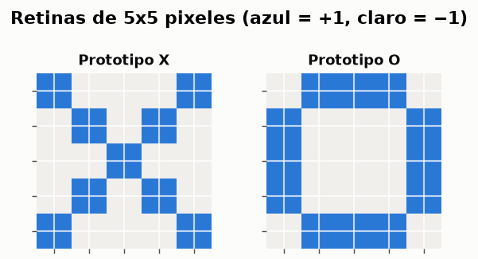
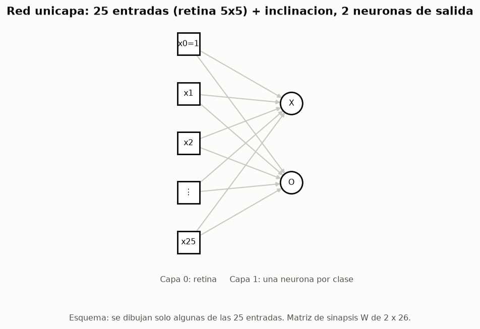
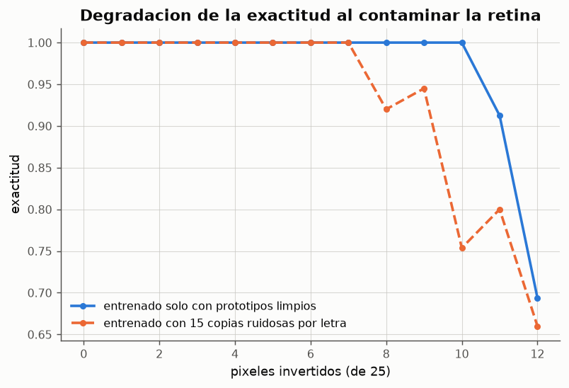
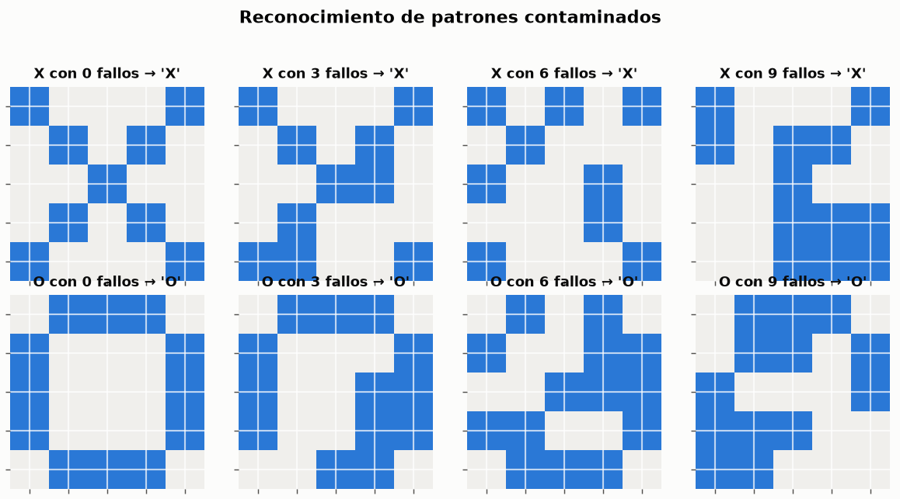

# Experimento 04 --- Perceptron multiclase: reconocimiento de las letras X y O

> Informe generado automaticamente por los scripts de `experimentos/` el 2026-09-14 22:46.
> No editar a mano: se regenera con `python experimentos/ejecutar_todo.py`.

Una red unicapa con 25 entradas y **dos** neuronas de salida, una por clase. Es el mismo algoritmo del experimento 02 aplicado a un problema de reconocimiento de patrones reales, y sirve para comprobar dos propiedades que `claseRN01.md` atribuye a las redes neuronales: que la memoria queda almacenada *en el patron de pesos* y que la red tolera *estimulos incompletos, ruidosos o parcialmente erroneos*.

## 1. Los prototipos y la arquitectura

*Figura: Los dos patrones de entrenamiento, codificados como vectores bipolares de 25 componentes.*

*Figura: Arquitectura del clasificador. La neurona 'X' responde +1 ante una X y −1 en cualquier otro caso; la neurona 'O' hace lo propio con la O.*

El objetivo de entrenamiento de cada patron es un **vector**: la X se codifica como d = (+1, −1) y la O como d = (−1, +1). Es un esquema *uno contra el resto*: cada neurona de salida es un perceptron independiente que aprende su propia frontera en el espacio de 25 dimensiones.

## 2. Entrenamiento con los prototipos limpios

Pesos iniciales nulos, a = 1. El algoritmo **converge en 2 epocas** con 2 correcciones y clasifica correctamente los dos prototipos. Con solo dos patrones el problema es trivialmente separable: en un espacio de 25 dimensiones, dos puntos distintos siempre pueden separarse por un hiperplano.

**Historial de entrenamiento**

| epoca | actualizaciones | patrones_mal | exactitud |
|---|---|---|---|
| 1 | 2 | 0 | 1 |
| 2 | 0 | 0 | 1 |

*Datos completos: [`04_historial_limpio.csv`](../tablas/04_historial_limpio.csv)*

## 3. Que aprende cada neurona: los pesos como plantilla

*Figura: Azul = peso positivo, naranja = peso negativo. Cada neurona ha memorizado una plantilla de 5x5 con la que compara toda entrada que reciba.*

**Que plantilla almacena exactamente cada neurona**

| neurona | los pesos coinciden con | w · x(X) | w · x(O) |
|---|---|---|---|
| X | anti-plantilla de la O (−O) | 17 | -25 |
| O | anti-plantilla de la X (−X) | -25 | 17 |

*Datos completos: [`04_identidad_pesos.csv`](../tablas/04_identidad_pesos.csv)*

El resultado ilustra de forma muy directa la afirmacion de `claseRN01.md`: *"las memorias se almacenan o representan en el patron de pesos de las interconexiones"*. El potencial y_in = w·x no es otra cosa que la **correlacion** entre la entrada y la plantilla almacenada: la neurona dispara cuando la imagen se parece a lo que recuerda.

Ahora bien, la plantilla que aprende cada neurona **no es su propia letra**, sino la *anti-plantilla de su rival*: la neurona X almacena −O y la neurona O almacena −X. No es un error, es consecuencia del algoritmo. Partiendo de pesos nulos, la primera presentacion (la X) deja y_in = 0 → +1 en ambas neuronas; solo la neurona O se equivoca, y su correccion es w ← w + a·d·x = −x(X). Al presentar la O ocurre lo simetrico. Como solo hay dos clases y las dos plantillas son casi opuestas, −O funciona como discriminador de la X igual de bien que la propia X: la tabla anterior muestra que la neurona X responde con potencial +17 ante una X y −25 ante una O.

Este es un buen ejemplo de una leccion general: una red neuronal no aprende *representaciones bonitas*, aprende **lo primero que resuelve el problema**. Interpretar los pesos exige comprobar que se esta leyendo lo que realmente hay, no lo que se espera encontrar.

## 4. Tolerancia a estimulos contaminados

*Figura: Exactitud media sobre 400 ensayos aleatorios por nivel de ruido y por letra.*

**Exactitud frente al numero de pixeles invertidos**

| pixeles_invertidos | porcentaje_retina | exactitud_entrenado_limpio | exactitud_entrenado_con_ruido |
|---|---|---|---|
| 0 | 0 | 1 | 1 |
| 1 | 4 | 1 | 1 |
| 2 | 8 | 1 | 1 |
| 3 | 12 | 1 | 1 |
| 4 | 16 | 1 | 1 |
| 5 | 20 | 1 | 1 |
| 6 | 24 | 1 | 1 |
| 7 | 28 | 1 | 1 |
| 8 | 32 | 1 | 0.92 |
| 9 | 36 | 1 | 0.945 |
| 10 | 40 | 1 | 0.75375 |
| 11 | 44 | 0.9125 | 0.8 |
| 12 | 48 | 0.69375 | 0.66 |

*Datos completos: [`04_tolerancia_ruido.csv`](../tablas/04_tolerancia_ruido.csv)*

La red mantiene el 100 % de aciertos hasta un nivel de contaminacion considerable y a partir de ahi degrada **suavemente**, sin colapsar de golpe. Esto es la *degradacion elegante* caracteristica de las redes neuronales: como la decision depende de la correlacion global entre la entrada y la plantilla, ningun pixel individual es critico. En 25 pixeles, invertir 12 o 13 equivale a destruir la mitad de la imagen, momento en el que el patron deja de parecerse mas a su prototipo que a su contrario.

**Un resultado contraintuitivo que conviene subrayar**: entrenar con copias ruidosas *no mejora* la tolerancia, sino que la empeora. La explicacion esta en la naturaleza del algoritmo. Entrenado solo con los prototipos limpios y pesos iniciales nulos, la unica correccion que hace la regla perceptronica deja `w = d·x`, es decir, **exactamente la plantilla de la letra**: el filtro adaptado, que es la solucion optima para este problema. Al anadir patrones ruidosos, el perceptron se detiene en la primera frontera que separa ese conjunto concreto --- no en la mejor --- y esa frontera esta peor alineada con los prototipos. El perceptron **no optimiza nada**: solo busca una solucion consistente. Esta es, de nuevo, la carencia que motiva el ADALINE.

*Figura: Ejemplos concretos de entradas degradadas y la clase que la red les asigna.*

## 5. Las dos lecturas del paso 4 del algoritmo

El paso 4 de `ICE-claseRN03.md` dice: *"Si yj ≠ dj(n), para **algun** j entre 1 y m1, entonces wji(n+1) = wji(n) + a·dj·xi(n), donde j = 1,...,m1"*. Leido al pie de la letra, el error de una sola neurona obligaria a corregir **todas**. La formulacion habitual --- y la unica para la que vale el teorema de convergencia --- trata cada neurona de salida como un perceptron independiente y corrige solo la que se equivoca. El codigo implementa la segunda por omision y ofrece la primera con `actualizar_todas_las_salidas=True`:

**Comparacion de ambas lecturas sobre el conjunto con ruido**

| variante | epocas | correcciones | convergio | exactitud |
|---|---|---|---|---|
| estandar: corregir solo la que falla | 2 | 2 | si | 1 |
| literal: corregir todas las salidas | 2 | 1 | si | 1 |

*Datos completos: [`04_variantes_paso4.csv`](../tablas/04_variantes_paso4.csv)*

## 6. Matriz de confusion y respuestas indeterminadas

**Matriz de confusion sobre 400 patrones con 6 pixeles invertidos**

| real | predicho X | predicho O |
|---|---|---|
| X | 200 | 0 |
| O | 0 | 200 |

*Datos completos: [`04_matriz_confusion.csv`](../tablas/04_matriz_confusion.csv)*

Con un punto de indeterminacion θ = 4 la red puede ademas **abstenerse**: de los 400 patrones degradados, 66 producen una respuesta ambigua (ninguna neurona activa, o mas de una). En un sistema real esa es informacion valiosa --- equivale a que la red diga *"no se"* en lugar de arriesgar una clasificacion --- y es la utilidad practica del punto neutro que introduce `ICE-claseRN03.md`.

## 7. Conclusiones

- La red unicapa con dos neuronas de salida aprende los dos prototipos en 2 epocas.
- La memoria de la red esta literalmente dibujada en su matriz de sinapsis, aunque no en la forma que uno esperaria: cada neurona almacena la **anti-plantilla de la clase rival**, que sobre dos clases es un discriminador equivalente.
- La exactitud se mantiene por encima del 90 % hasta los 11 pixeles invertidos, es decir, con una fraccion importante de la imagen destruida.
- Entrenar con ejemplos ruidosos **no** mejora la tolerancia en este caso: la degrada. Con pesos iniciales nulos, entrenar con los prototipos limpios produce el filtro adaptado, que es optimo; el ruido solo desvia al algoritmo hacia otra solucion igualmente valida sobre el conjunto de entrenamiento pero peor alineada con las plantillas. El perceptron busca *una* solucion, no la mejor.
- El punto de indeterminacion permite que la red se abstenga ante entradas ambiguas.
