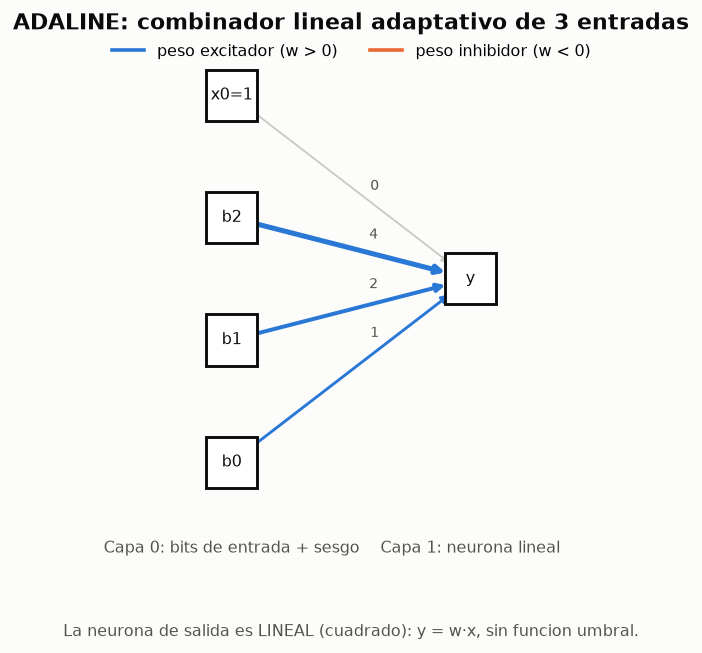
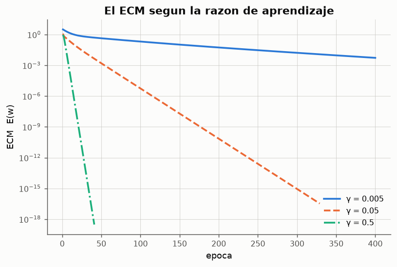
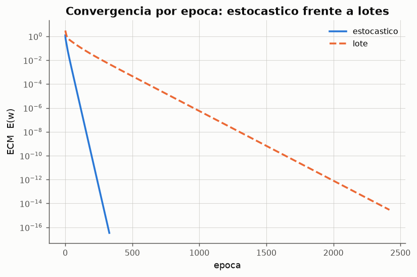

# Experimento 05 --- ADALINE y la regla Delta: descodificador de binario a decimal

> Informe generado automaticamente por los scripts de `experimentos/` el 2026-09-14 22:46.
> No editar a mano: se regenera con `python experimentos/ejecutar_todo.py`.

Widrow y Hoff (1960) disenaron un sistema de aprendizaje *que si tiene en cuenta el error producido*. La diferencia con el perceptron es de una sola linea de codigo y cambia todo: la regla Delta aprende sobre la **salida lineal**, sin pasarla por la funcion umbral, de modo que el error es una magnitud real y derivable y el aprendizaje se convierte en un **descenso del gradiente** sobre el error cuadratico medio. El experimento resuelve el descodificador binario-decimal propuesto en la clase y verifica que la red recupera los pesos optimos con error practicamente nulo.

## 1. El problema y su solucion analitica

**Conjunto de entrenamiento: los 8 patrones de 3 bits**

| b2 | b1 | b0 | decimal |
|---|---|---|---|
| 0 | 0 | 0 | 0 |
| 0 | 0 | 1 | 1 |
| 0 | 1 | 0 | 2 |
| 0 | 1 | 1 | 3 |
| 1 | 0 | 0 | 4 |
| 1 | 0 | 1 | 5 |
| 1 | 1 | 0 | 6 |
| 1 | 1 | 1 | 7 |

*Datos completos: [`05_conjunto.csv`](../tablas/05_conjunto.csv)*

El descodificador recibe una entrada en binario y produce como salida su valor decimal. Existe una expresion analitica exacta, lo que convierte al problema en un banco de pruebas ideal: se sabe de antemano cual es la respuesta correcta y se puede medir exactamente cuanto se aproxima la red.

$$
d = \sum_{i=1}^{n} 2^{\,i-1} x_i \;\Longrightarrow\; w^{*} = (w_0, w_1, w_2, w_3) = (0,\; 4,\; 2,\; 1)
$$

La salida deseada es una **funcion lineal** de las entradas, que es justamente la clase de problemas que un ADALINE puede resolver de forma exacta: *"solo resuelven problemas en los que los ejemplos son linealmente separables en terminos de clasificacion, o en los que las salidas son funciones lineales de las entradas. El caso del descodificador es un ejemplo"* (`ICE-claseRN04.md`).

Nota sobre el enunciado: la formula de la clase, d = Σ 2^i·x_i con i de 1 a n, daria pesos (2, 4, 8). Aqui se usa la convencion estandar d = Σ 2^(i−1)·x_i, con la que el rango de salida es 0..7. El cambio solo afecta la escala de los pesos optimos, no la naturaleza del problema.



*Figura: Arquitectura con los pesos optimos teoricos (4, 2, 1) y sesgo 0.*

## 2. La regla Delta

El error que se minimiza es el cuadratico medio sobre todos los patrones:

$$
E = \frac{1}{N}\sum_{p} E^{p}, \qquad E^{p} = \tfrac{1}{2}\left(d^{p} - y^{p}\right)^{2}
$$

El cambio de cada peso es proporcional a la derivada del error respecto a ese peso:

$$
\Delta^{p} w_j = -\gamma \frac{\partial E^{p}}{\partial w_j} = -\gamma \frac{\partial E^{p}}{\partial y^{p}}\frac{\partial y^{p}}{\partial w_j} = \gamma\left(d^{p} - y^{p}\right) x_j
$$

porque al ser una unidad lineal ∂y/∂w_j = x_j y ∂E/∂y = −(d − y). **La regla Delta es una extension de la regla del perceptron a valores de salida reales.** Las cuatro diferencias que enumera la clase:

- En el PERCEPTRON la salida es binaria; en el ADALINE es real.
- En el PERCEPTRON la diferencia entre salida deseada y obtenida es 0 o ±1; en el ADALINE se calcula la diferencia real.
- En el ADALINE existe una **medida de cuanto** se ha equivocado la red; en el PERCEPTRON solo se determina **si** se ha equivocado.
- En el ADALINE hay una razon de aprendizaje γ ∈ (0, 1) que regula cuanto afecta cada equivocacion a la modificacion de los pesos.

## 3. Traza secuencial: iteracion, pesos y error por patron

Pesos iniciales aleatorios en [0, 1] (semilla 1), γ = 0.05, modo estocastico (los pesos se actualizan despues de **cada** patron).

**Primeras 16 presentaciones de patron (dos epocas completas)**

| epoca | patron | x1 | x2 | x3 | d | y | error | error^2/2 | w0 | w1 | w2 | w3 |
|---|---|---|---|---|---|---|---|---|---|---|---|---|
| 1 | 1 | 0 | 0 | 0 | 0 | 0.511822 | -0.511822 | 0.130981 | 0.486231 | 0.950464 | 0.14416 | 0.948649 |
| 1 | 2 | 0 | 0 | 1 | 1 | 1.43488 | -0.43488 | 0.0945603 | 0.464487 | 0.950464 | 0.14416 | 0.926905 |
| 1 | 3 | 0 | 1 | 0 | 2 | 0.608646 | 1.39135 | 0.967933 | 0.534054 | 0.950464 | 0.213727 | 0.926905 |
| 1 | 4 | 0 | 1 | 1 | 3 | 1.67469 | 1.32531 | 0.878227 | 0.60032 | 0.950464 | 0.279993 | 0.993171 |
| 1 | 5 | 1 | 0 | 0 | 4 | 1.55078 | 2.44922 | 2.99933 | 0.722781 | 1.07292 | 0.279993 | 0.993171 |
| 1 | 6 | 1 | 0 | 1 | 5 | 2.78888 | 2.21112 | 2.44453 | 0.833337 | 1.18348 | 0.279993 | 1.10373 |
| 1 | 7 | 1 | 1 | 0 | 6 | 2.29681 | 3.70319 | 6.85681 | 1.0185 | 1.36864 | 0.465152 | 1.10373 |
| 1 | 8 | 1 | 1 | 1 | 7 | 3.95602 | 3.04398 | 4.63292 | 1.1707 | 1.52084 | 0.617352 | 1.25593 |
| 2 | 1 | 0 | 0 | 0 | 0 | 1.1707 | -1.1707 | 0.685264 | 1.11216 | 1.52084 | 0.617352 | 1.25593 |
| 2 | 2 | 0 | 0 | 1 | 1 | 2.36809 | -1.36809 | 0.935831 | 1.04376 | 1.52084 | 0.617352 | 1.18752 |
| 2 | 3 | 0 | 1 | 0 | 2 | 1.66111 | 0.338892 | 0.0574239 | 1.0607 | 1.52084 | 0.634296 | 1.18752 |
| 2 | 4 | 0 | 1 | 1 | 3 | 2.88252 | 0.117481 | 0.00690085 | 1.06658 | 1.52084 | 0.64017 | 1.1934 |
| 2 | 5 | 1 | 0 | 0 | 4 | 2.58741 | 1.41259 | 0.997699 | 1.1372 | 1.59147 | 0.64017 | 1.1934 |
| 2 | 6 | 1 | 0 | 1 | 5 | 3.92207 | 1.07793 | 0.580968 | 1.1911 | 1.64537 | 0.64017 | 1.24729 |
| 2 | 7 | 1 | 1 | 0 | 6 | 3.47664 | 2.52336 | 3.18368 | 1.31727 | 1.77153 | 0.766338 | 1.24729 |
| 2 | 8 | 1 | 1 | 1 | 7 | 5.10243 | 1.89757 | 1.80038 | 1.41215 | 1.86641 | 0.861217 | 1.34217 |

*Datos completos: [`05_traza_inicio.csv`](../tablas/05_traza_inicio.csv)*

**Ultimas 8 presentaciones: el error ya es despreciable**

| epoca | patron | x1 | x2 | x3 | d | y | error | error^2/2 | w0 | w1 | w2 | w3 |
|---|---|---|---|---|---|---|---|---|---|---|---|---|
| 329 | 1 | 0 | 0 | 0 | 0 | 1.73458e-08 | -1.73458e-08 | 1.50439e-16 | 1.64785e-08 | 4 | 2 | 1 |
| 329 | 2 | 0 | 0 | 1 | 1 | 1 | -7.36278e-09 | 2.71052e-17 | 1.61104e-08 | 4 | 2 | 1 |
| 329 | 3 | 0 | 1 | 0 | 2 | 2 | -7.0643e-09 | 2.49522e-17 | 1.57572e-08 | 4 | 2 | 1 |
| 329 | 4 | 0 | 1 | 1 | 3 | 3 | 3.12601e-09 | 4.88597e-18 | 1.59135e-08 | 4 | 2 | 1 |
| 329 | 5 | 1 | 0 | 0 | 4 | 4 | -7.13857e-09 | 2.54796e-17 | 1.55565e-08 | 4 | 2 | 1 |
| 329 | 6 | 1 | 0 | 1 | 5 | 5 | 2.90287e-09 | 4.21332e-18 | 1.57017e-08 | 4 | 2 | 1 |
| 329 | 7 | 1 | 1 | 0 | 6 | 6 | 2.528e-09 | 3.19538e-18 | 1.58281e-08 | 4 | 2 | 1 |
| 329 | 8 | 1 | 1 | 1 | 7 | 7 | 1.13312e-08 | 6.41984e-17 | 1.63946e-08 | 4 | 2 | 1 |

*Datos completos: [`05_traza_final.csv`](../tablas/05_traza_final.csv)*

```text
ADALINE  n=3  gamma=0.05  modo=estocastico
Estado: CONVERGIO en 329 epocas
Pesos finales (w0 = sesgo):   0.00000    4.00000    2.00000    1.00000
```

## 4. Convergencia y valores optimos de los pesos


*Figura: El ECM cae varios ordenes de magnitud: el descenso del gradiente converge al minimo global del paraboloide de error.*


*Figura: Los tres pesos convergen a 4, 2 y 1: la red ha descubierto por si sola el valor posicional de cada bit.*

**Pesos aprendidos frente a los valores optimos**

| peso | optimo_teorico | minimos_cuadrados | adaline | error_absoluto |
|---|---|---|---|---|
| w0 (sesgo) | 0 | 1.57009e-15 | 1.63946e-08 | 1.63946e-08 |
| w1 (bit 2) | 4 | 4 | 4 | 8.29372e-09 |
| w2 (bit 1) | 2 | 2 | 2 | 8.55003e-09 |
| w3 (bit 0) | 1 | 1 | 1 | 8.61588e-09 |

*Datos completos: [`05_pesos_finales.csv`](../tablas/05_pesos_finales.csv)*

**Comentario sobre los valores optimos** (consigna de la clase): la red converge a w = (0.0000, 4.0000, 2.0000, 1.0000), que coincide con el optimo teorico (0, 4, 2, 1) con un error maximo de 1.64e-08. Cada peso ha adoptado exactamente el **valor posicional** de su bit --- 4, 2 y 1 --- y el sesgo se ha anulado porque la funcion no tiene termino independiente. Es un caso poco habitual en el que los pesos de una red neuronal tienen una interpretacion semantica directa e inequivoca.

**Salida de la red para los 8 patrones**

| b2 | b1 | b0 | decimal | y_adaline | error |
|---|---|---|---|---|---|
| 0 | 0 | 0 | 0 | 1.63946e-08 | -1.63946e-08 |
| 0 | 0 | 1 | 1 | 1 | -7.77877e-09 |
| 0 | 1 | 0 | 2 | 2 | -7.84461e-09 |
| 0 | 1 | 1 | 3 | 3 | 7.71266e-10 |
| 1 | 0 | 0 | 4 | 4 | -8.10092e-09 |
| 1 | 0 | 1 | 5 | 5 | 5.14954e-10 |
| 1 | 1 | 0 | 6 | 6 | 4.49111e-10 |
| 1 | 1 | 1 | 7 | 7 | 9.06499e-09 |

*Datos completos: [`05_predicciones.csv`](../tablas/05_predicciones.csv)*

- Error cuadratico medio final: **3.373e-17**
- RMSE: **8.213e-09**
- Coeficiente de determinacion R²: **1.0000000000**
- Epocas necesarias: **329**

## 5. La superficie de error: por donde desciende el gradiente


*Figura: Cortando la superficie de error en el plano (w1, w2) --- los demas pesos fijados en su valor optimo --- las curvas de nivel son elipses concentricas. La trayectoria desciende hasta el minimo global.*


*Figura: La superficie de error de una unidad lineal es un paraboloide convexo: tiene un unico minimo y ningun minimo local donde quedar atrapado.*

Esta es la ventaja estructural del ADALINE frente al perceptron: **existe una funcion objetivo**. El perceptron solo sabe si acierta o falla y se detiene en cualquier solucion consistente; el ADALINE mide cuanto se equivoca y siempre se dirige al mismo punto, el minimo global, con independencia de donde arranque.

## 6. Efecto de la razon de aprendizaje



*Figura: γ pequeno: descenso lento pero seguro. γ grande: descenso rapido. Por encima de la cota de estabilidad, el error crece sin limite.*

**Razon de aprendizaje frente a convergencia**

| gamma | epocas | estado | ecm_final | error_max_pesos |
|---|---|---|---|---|
| 0.005 | 400 | no converge (limite) | 0.00534753 | 0.197482 |
| 0.02 | 400 | no converge (limite) | 9.93394e-09 | 0.000277266 |
| 0.05 | 329 | converge | 3.37308e-17 | 1.63946e-08 |
| 0.2 | 81 | converge | 1.5421e-18 | 3.19166e-09 |
| 0.5 | 41 | converge | 3.01222e-19 | 1.07301e-09 |
| 1 | 18 | diverge | inf | 1.10495e+06 |

*Datos completos: [`05_gamma.csv`](../tablas/05_gamma.csv)*

La cota teorica de estabilidad para el modo por lotes es γ < 2/λ_max = **1.0718**, donde λ_max es el mayor autovalor de la matriz de correlacion de las entradas. Por debajo de ella el descenso del gradiente es una contraccion y el error decrece monotonamente; por encima, cada paso sobrepasa el minimo con amplitud creciente y el aprendizaje **diverge**. Es la diferencia mas importante en la practica frente al perceptron, cuya convergencia no depende del valor de a.

## 7. Modo estocastico frente a modo por lotes



*Figura: Por epoca, el modo estocastico avanza mucho mas rapido porque actualiza los pesos 8 veces (una por patron) en lugar de una sola.*

**Comparacion de los dos regimenes de actualizacion**

| modo | epocas | actualizaciones_de_pesos | ecm_final | error_max_pesos |
|---|---|---|---|---|
| estocastico | 329 | 2632 | 3.37308e-17 | 1.63946e-08 |
| lote | 2418 | 2418 | 2.91621e-15 | 1.47536e-07 |

*Datos completos: [`05_modos.csv`](../tablas/05_modos.csv)*

El modo por lotes calcula el gradiente exacto de E y da un unico paso por epoca; el estocastico aproxima ese gradiente patron a patron, lo que introduce ruido pero produce N veces mas correcciones. El procedimiento descrito en la clase --- *"introducir un patron de entrada... si no se ha cumplido el criterio de convergencia, regresar a 2"* --- es el estocastico, que es tambien el que se usa en el resto del experimento.

## 8. Generalizacion: 4 y 5 bits

**El mismo modelo con 3, 4 y 5 bits**

| bits | patrones | epocas | ecm_final | R2 | pesos_aprendidos | pesos_optimos |
|---|---|---|---|---|---|---|
| 3 | 8 | 799 | 2.59162e-16 | 1 | [0. 4. 2. 1.] | [0. 4. 2. 1.] |
| 4 | 16 | 490 | 6.31102e-17 | 1 | [0. 8. 4. 2. 1.] | [0. 8. 4. 2. 1.] |
| 5 | 32 | 296 | 1.52699e-17 | 1 | [ 0. 16.  8.  4.  2.  1.] | [ 0. 16.  8.  4.  2.  1.] |

*Datos completos: [`05_generalizacion_bits.csv`](../tablas/05_generalizacion_bits.csv)*

El resultado se mantiene al crecer la dimension: la red recupera siempre los pesos posicionales 2^(n−1), ..., 2, 1 con R² = 1. Conviene notar que el numero de **epocas** *disminuye* al anadir bits, lo que a primera vista sorprende. La razon es que una epoca no es una cantidad fija de trabajo: con n bits hay 2^n patrones, de modo que el modo estocastico realiza 2^n correcciones por epoca. Contadas en actualizaciones de pesos --- que es la unidad de coste real --- el problema de 5 bits necesita mas trabajo, no menos.

## 9. Conclusiones

- El ADALINE aprende el descodificador **de forma exacta**: ECM = 3.37e-17 y R² = 1.00000000.
- Los pesos convergen a (0, 4, 2, 1), es decir, a los valores posicionales de los bits: la red descubre sola la estructura del problema.
- La superficie de error es un paraboloide convexo con un unico minimo; el descenso del gradiente llega siempre al mismo punto, con independencia de la inicializacion.
- La razon de aprendizaje es el parametro critico: por encima de γ ≈ 1.07 el aprendizaje diverge. El perceptron no tiene este problema, pero tampoco tiene una funcion objetivo que minimizar.
- El modelo hereda la limitacion del perceptron --- solo resuelve problemas lineales --- pero dentro de ese ambito es cualitativamente superior: mide el error, lo minimiza y produce salidas reales en lugar de binarias.
