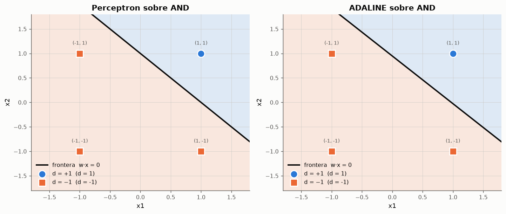
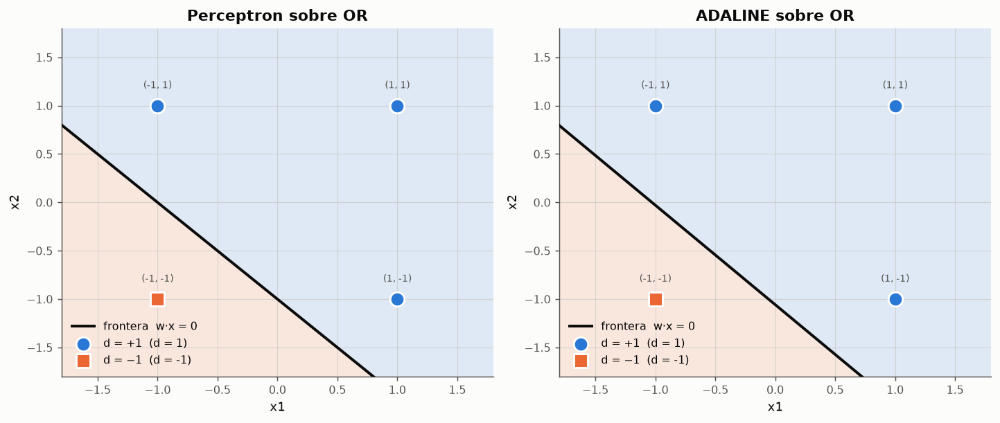
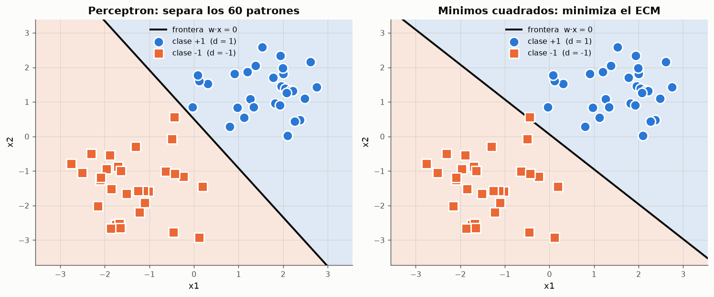

# Experimento 06 --- Perceptron frente a ADALINE sobre las mismas compuertas

> Informe generado automaticamente por los scripts de `experimentos/` el 2026-09-14 22:46.
> No editar a mano: se regenera con `python experimentos/ejecutar_todo.py`.

Misma arquitectura, misma tarea, dos reglas de aprendizaje. El perceptron deja de corregir en cuanto acierta; el ADALINE sigue reduciendo el error aunque ya clasifique bien. Este experimento cuantifica que consecuencias tiene esa diferencia sobre la calidad de la frontera obtenida.

## 1. Las dos reglas, lado a lado

$$
\text{Perceptron:}\quad \Delta w_i = a\,d\,x_i \;\;\text{ solo si } y \neq d \qquad\qquad \text{ADALINE:}\quad \Delta w_j = \gamma\,(d - y)\,x_j \;\;\text{ siempre}
$$

En el perceptron, `y` es la salida **umbralizada** y la correccion es todo o nada. En el ADALINE, `y` es la salida **lineal** y la correccion es proporcional al error cometido. De ahi la observacion de la clase: *"en el ADALINE existe una medida de cuanto se ha equivocado la red; en el PERCEPTRON solo se determina si se ha equivocado o no"*.

## 2. Fronteras, margenes y robustez

*Figura: Fronteras obtenidas por cada regla sobre la compuerta AND.*

*Figura: Fronteras obtenidas por cada regla sobre la compuerta OR.*

**Comparacion cuantitativa sobre AND y OR**

| compuerta | modelo | actualizaciones | exactitud | margen | ecm | robustez σ=0.4 | robustez σ=0.8 | w |
|---|---|---|---|---|---|---|---|---|
| AND | perceptron | 1 | 1 | 0.7071 | 0.5 | 0.9731 | 0.858 | [-1.  1.  1.] |
| AND | adaline | 388 | 1 | 0.6611 | 0.1255 | 0.9714 | 0.8572 | [-0.5    0.514  0.527] |
| OR | perceptron | 3 | 1 | 0.7071 | 0.5 | 0.9735 | 0.8538 | [1. 1. 1.] |
| OR | adaline | 388 | 1 | 0.6772 | 0.1255 | 0.9749 | 0.856 | [0.5   0.486 0.473] |

*Datos completos: [`06_comparacion.csv`](../tablas/06_comparacion.csv)*

Las columnas de robustez miden la exactitud cuando las entradas se perturban con ruido gaussiano (2000 ensayos por nivel). Ambos modelos clasifican perfectamente los cuatro patrones y, sobre estas compuertas, **acaban proponiendo practicamente la misma frontera**: la solucion de minimos cuadrados del AND bipolar es exactamente w = (−0.5, 0.5, 0.5), que es proporcional a la (−1, 1, 1) del perceptron. Las pequenas diferencias de margen que muestra la tabla no son una propiedad del ADALINE, sino el residuo de haberse detenido por tolerancia antes de alcanzar el minimo exacto.

Es un resultado que conviene registrar con claridad, porque contradice la intuicion habitual de que *"el ADALINE coloca mejor la frontera"*. Sobre cuatro patrones simetricos las dos reglas coinciden. Para ver una diferencia real hay que ir a un problema con muchos patrones y dispersion, como el de la seccion siguiente.

## 3. Donde las dos reglas si difieren: nubes de puntos

**Perceptron y ADALINE sobre 60 patrones dispersos pero separables**

| modelo | exactitud | margen | ecm |
|---|---|---|---|
| perceptron (semilla 0) | 1 | 0.0495 | 0.1751 |
| perceptron (semilla 1) | 1 | 0.1513 | 0.7203 |
| perceptron (semilla 2) | 1 | 0.1701 | 0.4135 |
| perceptron (semilla 3) | 1 | 0.0543 | 0.6119 |
| perceptron (semilla 4) | 1 | 0.1466 | 0.4923 |
| adaline | 1 | 0.0279 | 0.0636 |
| minimos cuadrados (exacto) | 0.983333 | -0.0347 | 0.0591 |

*Datos completos: [`06_nubes.csv`](../tablas/06_nubes.csv)*

*Figura: Dos objetivos distintos sobre los mismos datos. La recta de la derecha tiene menor error cuadratico; la de la izquierda clasifica mejor.*

Aqui la diferencia aparece, y en la direccion contraria a la esperada: la solucion de minimos cuadrados --- el optimo exacto al que tiende el ADALINE --- clasifica bien el 98.3% de los patrones y tiene **margen negativo**, mientras que el perceptron los separa todos. No es un fallo de implementacion: es que **los dos modelos optimizan cosas distintas**. Minimizar el error cuadratico penaliza a los patrones muy alejados de la frontera --- aunque esten bien clasificados --- y puede inclinar la recta hasta cruzar a un patron correcto con tal de reducir esa penalizacion. El perceptron, que solo mira los errores de clasificacion, es inmune a ese efecto.

Un matiz que la tabla deja ver: el ADALINE entrenado por descenso del gradiente si clasifica el 100 %, porque se detiene por tolerancia **antes** de llegar al optimo exacto. Detenerse pronto actua aqui como una regularizacion accidental --- el modelo se queda a medio camino entre el punto de partida y una solucion peor para clasificar. No es una virtud del metodo, es una casualidad afortunada del criterio de parada, y conviene no confundir una cosa con la otra.

La leccion practica: el ADALINE es la herramienta adecuada cuando la salida deseada es una **magnitud real** que se quiere aproximar (experimento 05); para clasificar pura y simplemente, el error cuadratico es un objetivo sustituto, no el objetivo real.

## 4. Dos criterios de parada distintos

- **Perceptron** (paso 5): *"si los pesos sinapticos no cambian para cada patron de entrenamiento durante la ultima vez que se realizo el paso 2, parar"*. Es un criterio **exacto y alcanzable**: cuando no hay errores, no hay correcciones, y el algoritmo se detiene solo. Si el problema no es separable, no se detiene nunca.
- **ADALINE**: el error cuadratico tiende a su minimo de forma asintotica, pero rara vez lo alcanza exactamente en aritmetica finita. Hace falta un criterio **aproximado**: detenerse cuando el mayor cambio de peso cae por debajo de una tolerancia, o cuando se agota un numero de epocas. A cambio, el algoritmo siempre termina, tambien en problemas no separables.

## 5. El ADALINE sobre el XOR: tambien falla, pero de otra manera

**Salida del ADALINE sobre los cuatro patrones del XOR**

| patron | d | y (lineal) | y (umbralizada) | error |
|---|---|---|---|---|
| (-1,-1) | -1 | 0.0810811 | 1 | -1.08108 |
| (-1,1) | 1 | -0.027027 | -1 | 1.02703 |
| (1,-1) | 1 | 0.027027 | 1 | 0.972973 |
| (1,1) | -1 | -0.0810811 | -1 | -0.918919 |

*Datos completos: [`06_adaline_xor.csv`](../tablas/06_adaline_xor.csv)*

El ADALINE **si converge** sobre el XOR --- en 99 epocas --- pero converge a la mejor aproximacion lineal posible, que es la solucion trivial w = [-0.     -0.027  -0.0541]: la red predice 0 para los cuatro patrones, con un ECM de 0.5018. Es el comportamiento esperable de una regresion lineal sobre datos sin componente lineal: todas las correlaciones entrada-salida se cancelan.

La diferencia de comportamiento es instructiva. Ante un problema imposible, el perceptron **oscila indefinidamente** y el ADALINE **se detiene tranquilamente en la mejor solucion mala**. El ADALINE nunca avisa de que el problema no es soluble: hay que mirar el error residual para darse cuenta. Ambos comparten la misma limitacion de fondo --- una capa, una frontera lineal --- que solo se supera anadiendo capas.

## 6. Conclusiones

- Sobre las compuertas AND y OR ambas reglas convergen a **la misma frontera** (los pesos del perceptron son un multiplo exacto de la solucion de minimos cuadrados): con cuatro patrones simetricos no hay diferencia que medir.
- Sobre 60 patrones dispersos si la hay, y favorece al perceptron en clasificacion: la solucion de minimos cuadrados deja patrones mal clasificados que el perceptron separa correctamente, porque minimizar el error cuadratico no es lo mismo que separar clases.
- El perceptron tiene un criterio de parada exacto pero no termina si el problema no es separable; el ADALINE siempre termina, pero puede terminar en una solucion inutil sin senalarlo.
- El ADALINE produce salidas **reales**, lo que le permite abordar problemas de aproximacion de funciones (experimento 05) y no solo de clasificacion.
- Ninguno de los dos supera la barrera de la separabilidad lineal: es una limitacion de la arquitectura unicapa, no de la regla de aprendizaje.
