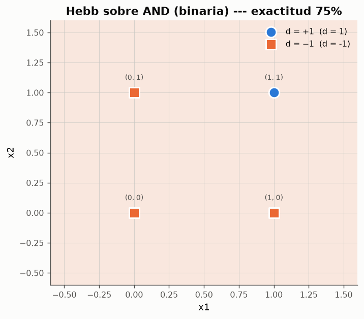
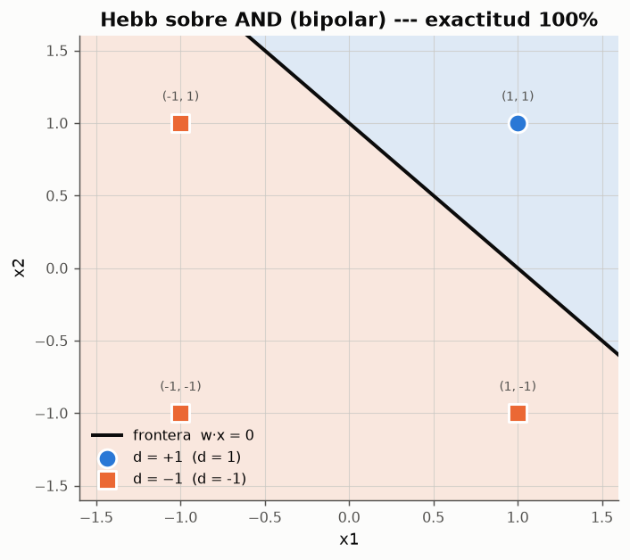
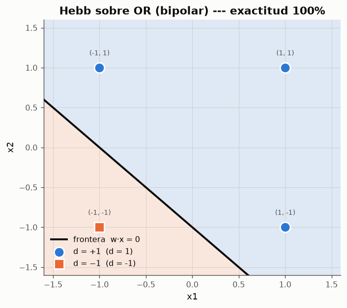
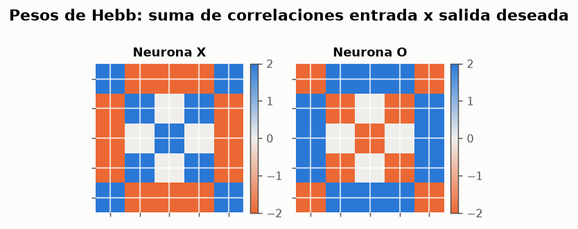
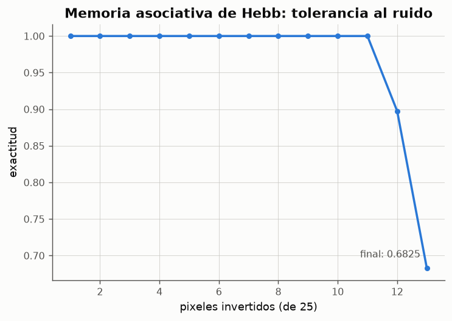

# Experimento 07 --- Regla de Hebb: aprendizaje de una sola pasada

> Informe generado automaticamente por los scripts de `experimentos/` el 2026-09-14 22:46.
> No editar a mano: se regenera con `python experimentos/ejecutar_todo.py`.

La regla de Hebb no comprueba errores, no itera y no tiene criterio de parada: presenta cada patron una vez y acumula el producto entrada x salida deseada. Es el aprendizaje mas barato posible, y el experimento delimita exactamente hasta donde llega --- incluido un caso en el que **falla**, que es el que mejor explica por que hizo falta inventar la regla perceptronica.

## 1. La regla de Hebb

$$
\Delta w_{ji} = a\, y_j(n)\, x_i(n), \qquad a > 0
$$

En su version **supervisada** para redes unicapa se sustituye la salida producida y_j por la salida deseada d_j, de modo que el peso final tras presentar los N patrones es

$$
w_{ji} = a \sum_{n=1}^{N} d_j(n)\, x_i(n)
$$

es decir, la **correlacion** entre la entrada i y la salida deseada j acumulada sobre todo el conjunto. No hay epocas, no hay errores y no hay criterio de parada: una sola pasada y el aprendizaje ha terminado. La razon de aprendizaje `a` solo escala los pesos, y como la frontera w·x = 0 no cambia al multiplicar w por una constante positiva, `a` **no afecta en absoluto** a la clasificacion resultante.

## 2. Codificacion binaria frente a bipolar

*Figura: Frontera obtenida en una sola pasada sobre AND con entradas en codificacion binaria.*

*Figura: Frontera obtenida en una sola pasada sobre AND con entradas en codificacion bipolar.*

*Figura: Frontera obtenida en una sola pasada sobre OR con entradas en codificacion bipolar.*

**Resultado de la regla de Hebb segun la codificacion de las entradas**

| codificacion | compuerta | w0 | w1 | w2 | exactitud | patrones_mal |
|---|---|---|---|---|---|---|
| binaria | AND | -2 | 0 | 0 | 0.75 | 1 |
| binaria | OR | 2 | 2 | 2 | 0.75 | 1 |
| bipolar | AND | -2 | 2 | 2 | 1 | 0 |
| bipolar | OR | 2 | 2 | 2 | 1 | 0 |

*Datos completos: [`07_hebb_codificacion.csv`](../tablas/07_hebb_codificacion.csv)*

## 3. Por que la codificacion decide el resultado

**Aporte de cada patron a cada peso (AND en codificacion binaria)**

| patron | d | aporte a w1 (d·x1) | aporte a w2 (d·x2) | aporte a w0 (d·1) |
|---|---|---|---|---|
| (0,0) | -1 | -0 | -0 | -1 |
| (0,1) | -1 | -0 | -1 | -1 |
| (1,0) | -1 | -1 | -0 | -1 |
| (1,1) | 1 | 1 | 1 | 1 |

*Datos completos: [`07_aportes_binaria.csv`](../tablas/07_aportes_binaria.csv)*

La suma de la columna `d·x1` es 0 y la de `d·x2` es 0: **ambos pesos quedan en cero**. La red termina con w = [-2.  0.  0.], que responde lo mismo ante cualquier entrada. El motivo es que el incremento es proporcional a x_i, de modo que todo patron con x_i = 0 es invisible para el peso w_i; y en el AND binario los unicos patrones con x_i = 1 se reparten entre las dos clases de forma que sus aportes se cancelan exactamente.

Con codificacion bipolar no hay entradas nulas: cada presentacion informa a **todos** los pesos, con signo. Por eso la clase insiste en trabajar con valores *"bipolares o antisimetricos"* al presentar la regla de Hebb. Es un detalle que parece cosmetico y decide entre funcionar y no funcionar.

## 4. Hebb como memoria asociativa: las letras X y O

*Figura: La regla de Hebb produce directamente la diferencia de plantillas (X − O) para una neurona y (O − X) para la otra.*

**Los pesos de Hebb son exactamente la diferencia de plantillas**

| neurona | w = (plantilla propia − plantilla rival) | w·x(X) | w·x(O) |
|---|---|---|---|
| X | True | 42 | -42 |
| O | True | -42 | 42 |

*Datos completos: [`07_hebb_letras.csv`](../tablas/07_hebb_letras.csv)*

*Figura: Exactitud al recuperar la letra correcta a partir de retinas degradadas (400 ensayos por nivel y por letra).*

**Tolerancia al ruido de la memoria hebbiana**

| pixeles_invertidos | exactitud |
|---|---|
| 0 | 1 |
| 1 | 1 |
| 2 | 1 |
| 3 | 1 |
| 4 | 1 |
| 5 | 1 |
| 6 | 1 |
| 7 | 1 |
| 8 | 1 |
| 9 | 1 |
| 10 | 1 |
| 11 | 0.8975 |
| 12 | 0.6825 |

*Datos completos: [`07_hebb_tolerancia.csv`](../tablas/07_hebb_tolerancia.csv)*

Con una sola pasada y sin corregir un solo error, la red clasifica correctamente los dos prototipos (100%) y mantiene una tolerancia al ruido comparable a la del perceptron del experimento 04. Esto es una **memoria asociativa** en el sentido de `claseRN01.md`: *"una RNA que opere como memoria asociativa accede a la informacion por contenido, en tal sentido es capaz de recuperar informacion a partir de estimulos incompletos, ruidosos o parcialmente erroneos"*. El precio de esa simplicidad aparece cuando los patrones almacenados no son ortogonales entre si: las correlaciones cruzadas se suman al peso y aparecen interferencias, algo que la regla perceptronica corrige por construccion y la de Hebb no.

## 5. Comparacion con la regla perceptronica

**Coste y calidad de ambas reglas sobre AND y OR (codificacion bipolar)**

| compuerta | hebb: presentaciones | hebb: exactitud | hebb: margen | perceptron: presentaciones | perceptron: exactitud | perceptron: margen |
|---|---|---|---|---|---|---|
| AND | 4 | 1 | 0.7071 | 8 | 1 | 0.7071 |
| OR | 4 | 1 | 0.7071 | 8 | 1 | 0.7071 |

*Datos completos: [`07_hebb_vs_perceptron.csv`](../tablas/07_hebb_vs_perceptron.csv)*

Sobre estos problemas la regla de Hebb obtiene el mismo resultado que la perceptronica con menos presentaciones, porque no necesita repasar el conjunto. La diferencia cualitativa es otra: **Hebb no garantiza nada**. Si el conjunto de entrenamiento no tiene la estructura adecuada --- como el AND en codificacion binaria --- la regla produce pesos inservibles y no hay forma de saberlo desde dentro del algoritmo, porque nunca comprueba sus propias respuestas. El perceptron, en cambio, tiene un teorema: si el problema es linealmente separable, converge.

## 6. Conclusiones

- La regla de Hebb aprende en **una sola pasada**, sin errores, iteraciones ni criterio de parada: es el aprendizaje mas barato que existe.
- Resuelve AND y OR en codificacion bipolar, pero **fracasa** en el AND binario, donde los aportes de los patrones se cancelan y todos los pesos quedan en cero.
- La razon de aprendizaje `a` es irrelevante: solo escala los pesos, sin mover la frontera.
- Como memoria asociativa funciona notablemente bien: los pesos son la diferencia de plantillas y recuperan la letra correcta a partir de retinas muy degradadas.
- Su debilidad es la ausencia de garantias: no verifica sus propias respuestas, de modo que puede fallar en silencio. Esa es la carencia que motiva la regla perceptronica.
